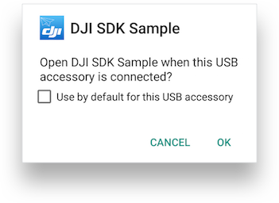

## Prepare Product

The user manual for each product should be reviewed to understand the full product setup (visit <a href="http://www.dji.com" target="_blank">http://www.dji.com</a> and navigate to the downloads page for each product). This section details some of the key points to remember. 

### Charge Batteries

Generally, all batteries of a product should be charged before running an application for best experience. This can include aircraft batteries, remote controller batteries, handheld gimbal batteries, and aircraft mounted gimbal batteries (for the Ronin MX). When a battery is too low, an aircraft may return home or land early in the application, or might not take off at all.
            
### Activate Product

Any new product will need to be activated through **DJI GO** before being used for the first time. **DJI GO** is available on the <a href="https://itunes.apple.com/en/app/dji-pilot/id943780750?mt=8" target="_blank">iOS App Store</a> and <a href="https://play.google.com/store/apps/details?id=dji.pilot&hl=en" target="_blank"> Google Store</a> and can be used to activate a product.

### Upgrade Product Firmware

Aircraft, remote controller and/or handheld controller firmware should be updated to the most recent release before beginning application testing and debugging. Different products sometimes have different processes for checking firmware version and upgrading firmware. Each product's page at <http://www.dji.com> has instructions in the **Downloads** section for upgrading firmware.

### Remote Controller Flight Mode Switch

For aircraft, the remote controller FAP or ASP flight mode switch needs to be in a specific position to accept SDK commands that change flight orientation and automate flight. Remote controllers and aircraft can sometimes be interchanged making the FAP/ASP switch configuration have several options.

|  Aircraft                |     Remote Controller    |  Switch  |
|:------------------------:|:------------------------:|:--------:|
| P3, Inspire (all models) | P3, Inspire (all models) |     F    |
| P3, Inspire (all models) | P4                       |     A    |
| P4                       | P3, Inspire (all models) |     P    |
| P4                       | P4                       |     P    |

## Internet Connectivity

Any SDK application will need internet connectivity the first time it runs to register with DJI and get authorization to use the SDK. After the first successful registration, the authorization will be stored locally, and internet connectivity will not be required for registration.

## Connect Mobile Device and Run Application

There are several connection configurations between mobile device and product:

* Mobile device -> USB -> Remote Controller -> Lightbridge -> Aircraft
* Mobile device -> WiFi -> Remote Controller -> WiFi -> Aircraft
* Mobile device -> WiFi -> Handheld Gimbal

There are several ways to initialize all products and run an application. An example for USB and WiFi connection scenarios is given below.

### USB Connection Procedure

_Phantom 4, Phantom 3 Professional, Phantom 3 Advanced, Inspire series, Matrice Series:_

 1. Turn on the Remote Controller. 
 * Turn on the Aircraft and wait until the Remote Controller has connected with the Aircraft.
 * Connect iOS/Android Mobile Device to the Remote Controller using a **Lightning** (iOS) or **USB** (Android) cable.
 * Run Application on the Mobile Device.
   
> **Note:** 
> 
> If using an Android device, the DJI Remote Controller needs to support <a href="https://source.android.com/devices/accessories/protocol.html" target="_blank"> AOA </a>. All recent versions of the firmware support AOA. AOA is supported if when the Sample Application connects with the Android device, a dialog similar to that below appears:
> 
>  
> 
> To learn how to change the default app for USB accessory, please check these two FAQs: [Android Device](../faq/index.html#How-do-I-reset-the-default-app-behavior-for-a-USB-Accessory-DJI-Product-on-Android-devices), [Samsung Device](../faq/index.html#How-do-I-reset-the-default-app-behavior-for-a-USB-Accessory-DJI-Product-on-Samsung-devices).
> 
  
### WiFi Connection Procedure

_Phantom 3 Standard, Phantom 3 4K:_

1. Turn on the Remote Controller.  
* Connect Mobile Device to the WiFi network created by the Remote Controller.
* Turn on the Aircraft and wait until the Remote Controller has connected with the Aircraft.
* Run Application on the Mobile Device.
  
_Osmo:_

1. Turn on the Osmo.  
* Connect Mobile Device to the WiFi network created by the Osmo.
* Run Application on Mobile Device.

