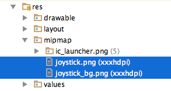
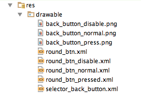
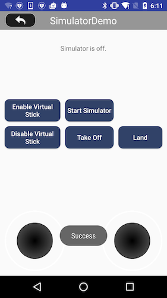
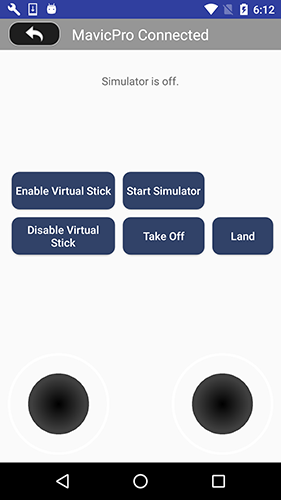

*If you come across any mistakes or bugs in this tutorial, please let us know using a Github issue, a post on the DJI Forum. Please feel free to send us Github pull request and help us fix any issues.*

---

In this tutorial, you will learn how to use the DJISimulator in your Android Studio project using DJI Mobile SDK. With the help of Virtual Stick control, you can input Virtual Stick flight control data and check the changes of simulator state in real time.

You can download the tutorial's final sample project from this [Github Page](https://github.com/DJI-Mobile-SDK-Tutorials/Android-SimulatorDemo).

We use Mavic Pro as an example to make this demo.

Let's get started!

## Introduction

DJISimulator is used to control the aircraft in a simulated environment based on the virtual stick input. The simulated aircraft state information will also be displayed on the screen.

You can use the `Simulator` class in `FlightController` to control the simulation. It allows both manual and automated flights to be simulated without actually flying the aircraft.

Additionally, simulator initialization, monitoring and termination can be controlled directly through the SDK allowing for application development in continuous integration environments.

## Application Activation and Aircraft Binding in China

 For DJI SDK mobile application used in China, it's required to activate the application and bind the aircraft to the user's DJI account. 

 If an application is not activated, the aircraft not bound (if required), or a legacy version of the SDK (< 4.1) is being used, all **camera live streams** will be disabled, and flight will be limited to a zone of 100m diameter and 30m height to ensure the aircraft stays within line of sight.

 To learn how to implement this feature, please check this tutorial [Application Activation and Aircraft Binding](./ActivationAndBinding.html).

## Implementing the UI of Application

### Importing Maven Dependency

Open Android Studio and select **File -> New -> New Project** to create a new project, named "DJISimulatorDemo". Enter the company domain and package name (Here we use "com.dji.simulatorDemo") you want and press Next. Set the minimum SDK version as `API 19: Android 4.4 (KitKat)` for "Phone and Tablet" and press Next. Then select "Empty Activity" and press Next. Lastly, leave the Activity Name as "MainActivity", and the Layout Name as "activity_main", press "Finish" to create the project.

In our previous tutorial [Importing and Activating DJI SDK in Android Studio Project](../application-development-workflow/workflow-integrate.html#Android-Studio-Project-Integration), you have learned how to import the Android SDK Maven Dependency and activate your application. If you haven't read that previously, please take a look at it and implement the related features. Once you've done that, continue to implement the next features.

### Building the Layouts of Activity

#### 1. Implementing the Joystick Control

In order to input some simulated data, like `pitch`, `roll`, `yaw` and `verticalThrottle`, you may need a joystick control. Let's work on the implementation of it.

We implement the joystick control base on an open source Github project <a href="https://github.com/Ville-/OnScreenJoystick/tree/master/OnScreenJoystick/src/com/salamientertainment/view/onscreenjoystick" target="_blank"> OnScreenJoystick </a>. You can download the Github project to get the **OnScreenJoystick.java** and **OnScreenJoystickListener.java** files or get them from this tutorial's Github Sample project. Now, copy and paste these two java files to the folder of "com.dji.simulatorDemo" on the left navigator as shown below:

When you touch on the **OnScreenJoystick** view, the `onTouch` method in OnScreenJoystickListener will be called and you can get the "OnScreenJoystick" joystick object, and the x and y coordinate of the knob parameters from this method as shown below:

~~~java
/** Called when the joystick is touched.
 * @param joystick The joystick which has been touched.
 * @param pX The x coordinate of the knob. Values are between -1 (left) and 1 (right).
 * @param pY The y coordinate of the knob. Values are between -1 (down) and 1 (up).
 */
public void onTouch(final OnScreenJoystick joystick, final float pX, final float pY);
~~~

> Note: The values for x coordinate of the knob are between -1 (left) and 1 (right), the values for y coordinate of the knob are between -1 (down) and 1 (up).

Next, copy and paste the **joystick.png** and **joystick_bg.png** files from this tutorial's Github sample project to the **mipmap** folder on the left navigator as shown below:

#### 2. Implementing the UI Elements in MainActivity Class

Now, let's open the MainActivity.java file and replace the code with the followings:

~~~java
public class MainActivity extends Activity implements View.OnClickListener {

    private static final String TAG = MainActivity.class.getName();
    protected TextView mConnectStatusTextView;
    private Button mBtnEnableVirtualStick;
    private Button mBtnDisableVirtualStick;
    private ToggleButton mBtnSimulator;
    private Button mBtnTakeOff;
    private Button mBtnLand;
    private TextView mTextView;

    private OnScreenJoystick mScreenJoystickRight;
    private OnScreenJoystick mScreenJoystickLeft;

    @Override
    protected void onCreate(Bundle savedInstanceState) {
        super.onCreate(savedInstanceState);

        setContentView(R.layout.activity_main);
        initUI();
    }

    @Override
    public void onResume() {
        Log.e(TAG, "onResume");
        super.onResume();
    }

    @Override
    public void onPause() {
        Log.e(TAG, "onPause");
        super.onPause();
    }

    @Override
    public void onStop() {
        Log.e(TAG, "onStop");
        super.onStop();
    }

    public void onReturn(View view){
        Log.e(TAG, "onReturn");
        this.finish();
    }

    @Override
    protected void onDestroy() {
        Log.e(TAG, "onDestroy");
        super.onDestroy();
    }

    private void initUI() {

        mBtnEnableVirtualStick = (Button) findViewById(R.id.btn_enable_virtual_stick);
        mBtnDisableVirtualStick = (Button) findViewById(R.id.btn_disable_virtual_stick);
        mBtnTakeOff = (Button) findViewById(R.id.btn_take_off);
        mBtnLand = (Button) findViewById(R.id.btn_land);
        mBtnSimulator = (ToggleButton) findViewById(R.id.btn_start_simulator);
        mTextView = (TextView) findViewById(R.id.textview_simulator);
        mConnectStatusTextView = (TextView) findViewById(R.id.ConnectStatusTextView);
        mScreenJoystickRight = (OnScreenJoystick)findViewById(R.id.directionJoystickRight);
        mScreenJoystickLeft = (OnScreenJoystick)findViewById(R.id.directionJoystickLeft);

        mBtnEnableVirtualStick.setOnClickListener(this);
        mBtnDisableVirtualStick.setOnClickListener(this);
        mBtnTakeOff.setOnClickListener(this);
        mBtnLand.setOnClickListener(this);

        mBtnSimulator.setOnCheckedChangeListener(new CompoundButton.OnCheckedChangeListener() {
            @Override
            public void onCheckedChanged(CompoundButton buttonView, boolean isChecked) {
            }
        });

        mScreenJoystickLeft.setJoystickListener(new OnScreenJoystickListener(){

            @Override
            public void onTouch(OnScreenJoystick joystick, float pX, float pY) {
          }
        });

        mScreenJoystickRight.setJoystickListener(new OnScreenJoystickListener() {

            @Override
            public void onTouch(OnScreenJoystick joystick, float pX, float pY) {
            }
        });
    }

    @Override
    public void onClick(View v) {

        switch (v.getId()) {
            case R.id.btn_enable_virtual_stick:
                break;
            case R.id.btn_disable_virtual_stick:
                break;
            case R.id.btn_take_off:
                break;
            case R.id.btn_land:
                break;
            default:
                break;
        }
    }
}
~~~

In the code above, we implement the following features:

**1.** Create the layout UI elements variables, including two TextView `mConnectStatusTextView`, `mTextView`, four buttons `mBtnEnableVirtualStick`, `mBtnDisableVirtualStick`, `mBtnTakeOff`, `mBtnLand`, one Toggle Button `mBtnSimulator` and two OnScreenJoystick control `mScreenJoystickRight` and `mScreenJoystickLeft`. 

**2.** In the `onCreate()` method, we request several permissions at runtime to ensure the SDK works well when the compile and target SDK version is higher than 22(Like Android Marshmallow 6.0 device and API 23). Then invoke the `initUI()` method to initialize UI variables and their listeners.

**3.** In the `initUI()` method, we first initialize the UI elements variables, then set the click listener of the four buttons to "this". Moreover, implement the `onCheckedChanged()` method of toggle button `mBtnSimulator`'s "setOnCheckedChangeListener". Finally, implement the `onTouch()` method of the two `OnScreenJoystick` objects' "setJoystickListener".

**4.** Override the `onClick()` method to implement the four buttons' click actions.

#### 3. Implementing the MainActivity Layout

Open the **activity_main.xml** layout file and replace the code with the following:

~~~xml
<?xml version="1.0" encoding="utf-8"?>
<RelativeLayout xmlns:android="http://schemas.android.com/apk/res/android"
    xmlns:tools="http://schemas.android.com/tools"
    android:layout_width="match_parent"
    android:layout_height="match_parent"
    android:orientation="vertical">

    <RelativeLayout
        android:id="@+id/main_title_rl"
        android:layout_width="fill_parent"
        android:layout_height="40dp"
        android:background="@color/black_overlay" >

        <ImageButton
            android:id="@+id/ReturnBtn"
            android:layout_width="wrap_content"
            android:layout_height="35dp"
            android:layout_alignParentLeft="true"
            android:layout_centerVertical="true"
            android:layout_marginLeft="5dp"
            android:adjustViewBounds="true"
            android:background="@android:color/transparent"
            android:onClick="onReturn"
            android:scaleType="centerInside"
            android:src="@drawable/selector_back_button" />

        <TextView
            android:id="@+id/ConnectStatusTextView"
            android:layout_width="wrap_content"
            android:layout_height="wrap_content"
            android:layout_centerInParent="true"
            android:text="SimulatorDemo"
            android:textColor="@android:color/white"
            android:textSize="19sp" />
    </RelativeLayout>

    <TextView
        android:layout_marginTop="70dp"
        android:layout_width="wrap_content"
        android:layout_height="wrap_content"
        android:layout_centerHorizontal="true"
        android:text="Simulator is off."
        android:id="@+id/textview_simulator"/>

    <Button
        android:layout_width="wrap_content"
        android:layout_height="wrap_content"
        android:text="Enable Virtual Stick"
        style="@style/common_button"
        android:id="@+id/btn_enable_virtual_stick"
        android:layout_marginLeft="5dp"
        android:layout_alignTop="@+id/btn_start_simulator"
        android:layout_alignStart="@+id/directionJoystickRight"
        android:layout_marginTop="0dp" />

    <Button
        android:layout_width="wrap_content"
        android:layout_height="wrap_content"
        android:text="Disable Virtual Stick"
        style="@style/common_button"
        android:id="@+id/btn_disable_virtual_stick"
        android:layout_below="@+id/btn_enable_virtual_stick"
        android:layout_alignStart="@+id/btn_enable_virtual_stick"
        android:layout_marginLeft="0dp"
        android:layout_alignEnd="@+id/btn_enable_virtual_stick" />

    <Button
        android:layout_width="wrap_content"
        android:layout_height="wrap_content"
        android:text="Take Off"
        style="@style/common_button"
        android:id="@+id/btn_take_off"
        android:layout_alignTop="@+id/btn_disable_virtual_stick"
        android:layout_alignStart="@+id/btn_start_simulator"
        android:layout_marginTop="0dp"
        android:layout_alignEnd="@+id/btn_start_simulator" />

    <ToggleButton
        android:id="@+id/btn_start_simulator"
        android:layout_width="wrap_content"
        android:layout_height="wrap_content"
        android:text="Start Simulator"
        android:textOff="Start Simulator"
        android:textOn="Stop Simulator"
        style="@style/common_button"
        android:layout_below="@+id/textview_simulator"
        android:layout_toEndOf="@+id/btn_enable_virtual_stick"
        android:layout_marginTop="107dp"
        android:layout_marginLeft="10dp" />

    <Button
        android:layout_width="wrap_content"
        android:layout_height="wrap_content"
        android:text="Land"
        style="@style/common_button"
        android:id="@+id/btn_land"
        android:layout_alignTop="@+id/btn_take_off"
        android:layout_marginTop="0dp"
        android:layout_alignEnd="@+id/directionJoystickLeft"
        android:layout_toEndOf="@+id/btn_take_off"
        android:layout_marginLeft="10dp" />

    <com.dji.simulatorDemo.OnScreenJoystick
        android:id="@+id/directionJoystickRight"
        android:layout_width="130dp"
        android:layout_height="130dp"
        android:layout_alignParentLeft="true"
        android:layout_alignParentBottom="true"
        android:layout_marginBottom="10dp"
        android:layout_marginLeft="10dp"
        android:background="@mipmap/joystick_bg"/>

    <com.dji.simulatorDemo.OnScreenJoystick
        android:id="@+id/directionJoystickLeft"
        android:layout_width="130dp"
        android:layout_height="130dp"
        android:layout_alignParentRight="true"
        android:layout_alignParentBottom="true"
        android:layout_marginBottom="10dp"
        android:layout_marginRight="10dp"
        android:background="@mipmap/joystick_bg"/>

</RelativeLayout>
~~~

 In the xml file, first, we implement the RelativeLayout element. We declare an ImageButton(id: ReturnBtnCamera) element to exit the application, and a TextView(id: ConnectStatusTextView) element to show the connection status text. 
  
  Next, create a TextureView(id: textview\_simulator) element to show the simulator state infos. Moreover, create the "Enable Virtual Stick" button(id: btn\_enable\_virtual\_stick), "Disable Virtual Stick" button(id: btn\_disable\_virtual\_stick), "Take Off" button(id: btn\_take\_off), "Land" button(id: btn\_land). Moreover, create the "Start Simulator" toggle button(id: btn\_start\_simulator) and set its **textOn** and **textOff** params to "Start Simulator" and "Stop Simulator".
  
  Lastly, we create two OnScreenJoystick elements (id: directionJoystickRight) and (id:directionJoystickLeft) for joystick control.
  
#### 4. Configuring the Resources

  Once you finish the above steps, let's add some resources files to the **res** folder on the left navigator of Android Studio.
  
  Copy the following image and xml files from the tutorial Github Sample project's **drawable** folder to your project, they are used for the button's UI:
  
  
  
  Next, open the "colors.xml" file and add the following code at the bottom to declare the black overlay color:
  
~~~xml
<color name="black_overlay">#66000000</color>
~~~

 Moreover, open the "strings.xml" file and add the "success" string:
 
~~~xml
<string name="success">Success</string>
~~~

 Lastly, open the "styles.xml" file and add the following code to declare the "common_button" style:
 
~~~xml
<!-- Common button style -->

~~~

#### Implementing Registration in DJISimulatorApplication and MainActivity

Once you finish the above steps, let's register the application on DJI Developer Website and get the **App Key**. If you are not familiar with the App Key, please check [Generate an App Key](../quick-start/index.html#generate-an-app-key) for details.

Moreover, please check the [Creating an Camera Application](./index.html#registering-the-application) tutorial and the [sample project](https://github.com/DJI-Mobile-SDK-Tutorials/Android-SimulatorDemo) of this tutorial for the detailed implementations of the `MApplication`, `DJISimulatorApplication` and `MainActivity`. 
  
Now let's build and run the project and install it to your Android device. If everything goes well, you should see the "success" textView like the following screenshot when you register the app successfully.

## Working on MainActivity class

### Update Product Connection Status

Please check the [sample project](https://github.com/DJI-Mobile-SDK-Tutorials/Android-SimulatorDemo) of this tutorial for the detailed implementations.

Now let's build and run the project and install it to your Android device. Then connect the demo application to your Mavic Pro (Please check [Run Application](../application-development-workflow/workflow-run.html) for more details), if everything goes well, you should see the title textView content updates to "MavicPro Connected" as shown below:

### Implementing Virtual Stick Control

 Since we have implemented the Joystick control, now let's continue to work on sending virtual stick flight control data to the aircraft. First, we create a FlightController variable `mFlightController`, a Timer variable `mSendVirtualStickDataTimer`, a SendVirtualStickDataTask(extends from TimerTask class) variable `mSendVirtualStickDataTask` and four float variables on top of `onCreate()` method as shown below:
 
 ~~~java
    private FlightController mFlightController;
    private Timer mSendVirtualStickDataTimer;
    private SendVirtualStickDataTask mSendVirtualStickDataTask;
    
    private float mPitch;
    private float mRoll;
    private float mYaw;
    private float mThrottle;
 ~~~
 
 We may use the `mPitch`, `mRoll`, `mYaw` and `mThrottle` variables to store the **pitch**, **roll**, **yaw** and **vertical throttle** virtual stick flight control data.
 
 Next, create the `initFlightController()` method, invoke it in the `onResume()` method and implement the SendVirtualStickDataTask class as shown below:
 
~~~java
private void initFlightController() {

    Aircraft aircraft = DJISimulatorApplication.getAircraftInstance();
    if (aircraft == null || !aircraft.isConnected()) {
        showToast("Disconnected");
        mFlightController = null;
        return;
    } else {
        mFlightController = aircraft.getFlightController();
    }
}

@Override
public void onResume() {
    Log.e(TAG, "onResume");
    super.onResume();
    updateTitleBar();
    initFlightController();
}

class SendVirtualStickDataTask extends TimerTask {

        @Override
        public void run() {

            if (mFlightController != null) {
                mFlightController.sendVirtualStickFlightControlData(
                        new FlightControlData(
                                mPitch, mRoll, mYaw, mThrottle
                        ), new CommonCallbacks.CompletionCallback() {
                            @Override
                            public void onResult(DJIError djiError) {

                            }
                        }
                );
            }
        }
    }
~~~

In the code above, we implement the following features:

**1.** In the `initFlightController()` method, we first check if the aircraft is not null and is connected, then invoke the `getFlightController()` method of Aircraft to get the `mFlightController` variable.

**2.** Next, extends from TimerTask class to create the **SendVirtualStickDataTask** class. Inside the class, override the `run()` method to invoke the `sendVirtualStickFlightControlData()` method of FlightController to send virtual stick flight control data. Here, we create the **FlightControlData** object from the four float variables declared before: `mPitch`, `mRoll`, `mYaw` and `mThrottle`.

Once you finish the above steps, let's implement the `setJoystickListener()` methods of `mScreenJoystickLeft` and `mScreenJoystickRight` variables at the bottom of `initUI()` method as shown below:

~~~java
    mScreenJoystickLeft.setJoystickListener(new OnScreenJoystickListener(){

        @Override
        public void onTouch(OnScreenJoystick joystick, float pX, float pY) {
            if(Math.abs(pX) < 0.02 ){
                pX = 0;
            }

            if(Math.abs(pY) < 0.02 ){
                pY = 0;
            }
            float pitchJoyControlMaxSpeed = 10;
            float rollJoyControlMaxSpeed = 10;

            mPitch = (float)(pitchJoyControlMaxSpeed * pX);

            mRoll = (float)(rollJoyControlMaxSpeed * pY);

            if (null == mSendVirtualStickDataTimer) {
                mSendVirtualStickDataTask = new SendVirtualStickDataTask();
                mSendVirtualStickDataTimer = new Timer();
                mSendVirtualStickDataTimer.schedule(mSendVirtualStickDataTask, 100, 200);
            }

        }

    });

    mScreenJoystickRight.setJoystickListener(new OnScreenJoystickListener() {

        @Override
        public void onTouch(OnScreenJoystick joystick, float pX, float pY) {
            if(Math.abs(pX) < 0.02 ){
                pX = 0;
            }

            if(Math.abs(pY) < 0.02 ){
                pY = 0;
            }
            float verticalJoyControlMaxSpeed = 2;
            float yawJoyControlMaxSpeed = 30;

            mYaw = (float)(yawJoyControlMaxSpeed * pX);
            mThrottle = (float)(verticalJoyControlMaxSpeed * pY);

            if (null == mSendVirtualStickDataTimer) {
                mSendVirtualStickDataTask = new SendVirtualStickDataTask();
                mSendVirtualStickDataTimer = new Timer();
                mSendVirtualStickDataTimer.schedule(mSendVirtualStickDataTask, 0, 200);
            }

        }
    });
~~~

Here, we implement the following features:

**1.** Override the `onTouch()` method of **setJoystickListener** and filter the `pX` and `pY` variables' value by checking if they are less than 0.02. We should not send the virtual stick data to flight controller too frequently if the value is too small.

**2.** Get the maximum velocity of pitch and roll control, then store them to `pitchJoyControlMaxSpeed` and `rollJoyControlMaxSpeed` variables. Since the value of `pX` is between -1 (left) and 1 (right), the value of `pY` is between -1 (down) and 1 (up), we multiply by using the `pitchJoyControlMaxSpeed` and `rollJoyControlMaxSpeed` values to update the `mPitch` and `mRoll` data. Here we take Mode 2(American mode) of remote controller as example.

**3.** Lastly, we check if `mSendVirtualStickDataTimer` is null, and create it by invoking the `SendVirtualStickDataTask()` method. Then, create the `mSendVirtualStickDataTimer` and invoke its `schedule()` method to trigger the timer by passing `mSendVirtualStickDataTask` variable, 0 milliseconds of delay and 200 milliseconds between subsequent executions.

**4.** Similarly, implement the `setJoystickListener()` method of `mScreenJoystickRight` variable to update the `mYaw` and `mThrottle` values and trigger the timer to send virtual stick data to the aircraft's flight controller.

Now, when you control the left and right joysticks, they will send the simulated virtual stick data (Including **Yaw**, **Pitch**, **Roll** and **Vertical Throttle**) to the flight controller of aircraft.

Lastly, override the `onClick()` method to implement the enable and disable virtual stick control buttons click actions as shown below:

~~~java
@Override
  public void onClick(View v) {

     switch (v.getId()) {
        case R.id.btn_enable_virtual_stick:
            if (mFlightController != null){

                mFlightController.setVirtualStickModeEnabled(true, new CommonCallbacks.CompletionCallback() {
                    @Override
                    public void onResult(DJIError djiError) {
                        if (djiError != null){
                            showToast(djiError.getDescription());
                        }else
                        {
                            showToast("Enable Virtual Stick Success");
                        }
                    }
                });
            }
            break;

        case R.id.btn_disable_virtual_stick:
            if (mFlightController != null){
                mFlightController.setVirtualStickModeEnabled(false, new CommonCallbacks.CompletionCallback() {
                    @Override
                    public void onResult(DJIError djiError) {
                        if (djiError != null) {
                            showToast(djiError.getDescription());
                        } else {
                            showToast("Disable Virtual Stick Success");
                        }
                    }
                });
            }
            break;
        }
    }
~~~

This invoke the `enableVirtualStickControlMode()` and `disableVirtualStickControlMode()` methods of FlightController to enable and disable the virtual stick control mode.

### Implementing DJISimulator

Let's implement the DJISimulator feature now. In order to update the simulator state data in `mTextView`, we may need to implement the `setStateCallback()` method of DJISimulator in the `initFlightController()` method as shown below:

~~~objc
    private void initFlightController() {

        Aircraft aircraft = DJISimulatorApplication.getAircraftInstance();
        if (aircraft == null || !aircraft.isConnected()) {
            showToast("Disconnected");
            mFlightController = null;
            return;
        } else {
            mFlightController = aircraft.getFlightController();
            mFlightController.setRollPitchControlMode(RollPitchControlMode.VELOCITY);
            mFlightController.setYawControlMode(YawControlMode.ANGULAR_VELOCITY);
            mFlightController.setVerticalControlMode(VerticalControlMode.VELOCITY);
            mFlightController.setRollPitchCoordinateSystem(FlightCoordinateSystem.BODY);
            mFlightController.getSimulator().setStateCallback(new SimulatorState.Callback() {
                @Override
                public void onUpdate(final SimulatorState stateData) {
                    new Handler(Looper.getMainLooper()).post(new Runnable() {
                        @Override
                        public void run() {

                            String yaw = String.format("%.2f", stateData.getYaw());
                            String pitch = String.format("%.2f", stateData.getPitch());
                            String roll = String.format("%.2f", stateData.getRoll());
                            String positionX = String.format("%.2f", stateData.getPositionX());
                            String positionY = String.format("%.2f", stateData.getPositionY());
                            String positionZ = String.format("%.2f", stateData.getPositionZ());

                            mTextView.setText("Yaw : " + yaw + ", Pitch : " + pitch + ", Roll : " + roll + "\n" + ", PosX : " + positionX +
                                    ", PosY : " + positionY +
                                    ", PosZ : " + positionZ);
                        }
                    });
                }
            });
        }
    }
~~~

In the code above, we override the `onUpdate()` method to get the lastest simulator state data, then invoke the `getYaw()`, `getPitch()`, `getRoll()`, `getPositionX()`, `getPositionY()` and `getPositionZ()` methods of `SimulatorState` to get the updated yaw, pitch, roll, positionX, positionY and positionZ values and show them in `mTextView`.

Next, override the `onCheckedChanged()` method of `mBtnSimulator` toggleButton's  `setOnCheckedChangeListener()` method as shown below:

~~~java
mBtnSimulator.setOnCheckedChangeListener(new CompoundButton.OnCheckedChangeListener() {
    @Override
    public void onCheckedChanged(CompoundButton buttonView, boolean isChecked) {
        if (isChecked) {

            mTextView.setVisibility(View.VISIBLE);

            if (mFlightController != null) {

                mFlightController.getSimulator()
                        .start(InitializationData.createInstance(new LocationCoordinate2D(23, 113), 10, 10),
                                new CommonCallbacks.CompletionCallback() {
                            @Override
                            public void onResult(DJIError djiError) {
                                if (djiError != null) {
                                    showToast(djiError.getDescription());
                                }else
                                {
                                    showToast("Start Simulator Success");
                                }
                            }
                        });
            }

        } else {

            mTextView.setVisibility(View.INVISIBLE);

            if (mFlightController != null) {
                mFlightController.getSimulator()
                        .stop(new CommonCallbacks.CompletionCallback() {
                                    @Override
                                    public void onResult(DJIError djiError) {
                                        if (djiError != null) {
                                            showToast(djiError.getDescription());
                                        }else
                                        {
                                            showToast("Stop Simulator Success");
                                        }
                                    }
                                }
                        );
            }
        }
    }
});
~~~

In the code above, we implement the following features:

**1.** If the `mBtnSimulator` toggle button is checked, then show the `mTextView`. Next, if the `mFlightController` is not null, we invoke the `start()` method of DJISimulator by passing  a `InitializationData` with LocationCoordinate2D struct (lattitude 23 and longitude 113), updateFrequency 10 and satelliteCount 10 parameters to it. For more details of DJISimulatorInitializationData, please check the [Android API Reference](https://developer.dji.com/iframe/mobile-sdk-doc/android/reference/dji/sdk/FlightController/DJISimulatorInitializationData.html).

**2.** Next, overide the `onResult()` method of `start()`, invoke `showToast()` method to show the start simulator result to the user.

**3.** Similarly, if the `mBtnSimulator` toggle button is not checked, then invoke the `stop()` method of DJISimulator to stop the simulator. Furthermore, override the `onResult()` method and invoke the `showToast()` method to show the stop simulator result to the user.

### Working on Takeoff and AutoLanding features

Finally, let's add the following code at the bottom of `onClick()` method to implement the **Take off** and **Land** buttons' click actions as shown below:

~~~java
case R.id.btn_take_off:
    if (mFlightController != null){
        mFlightController.startTakeoff(
                new CommonCallbacks.CompletionCallback() {
                    @Override
                    public void onResult(DJIError djiError) {
                        if (djiError != null) {
                            showToast(djiError.getDescription());
                        } else {
                            showToast("Take off Success");
                        }
                    }
                }
        );
    }

    break;

case R.id.btn_land:
    if (mFlightController != null){

        mFlightController.startLanding(
                new CommonCallbacks.CompletionCallback() {
                    @Override
                    public void onResult(DJIError djiError) {
                        if (djiError != null) {
                            showToast(djiError.getDescription());
                        } else {
                            showToast("Start Landing");
                        }
                    }
                }
        );

    }

    break;
~~~

For the case of "R.id.btn\_take\_off", we invoke the `startTakeoff()` method of FlightController to send the take off command to the aircraft. Similiarly, for the case of "R.id.btn_land", we invoke the `startLanding()` method to send the auto landing command. It's just that simple and easy.

We have gone through a long way in this tutorial, now let's build and run the project, connect the demo application to  your Mavic Pro (Please check [Run Application](../application-development-workflow/workflow-run.html) for more details) and check all the features we have implemented so far. 

If everything goes well, you should see something similiar to the following gif animations like this:

 <html>

</html>
 
- If the demo application is connected with Mavic Pro successfully, you should see the title textView content updates to "MavicPro Connected".

- Press **Enable Virtual Stick** button to enable virtual stick control, then press **Start Simulator** to start the simulator.

- Moreover, press the **Take Off** button to send take off command to the aircraft, if the command executes successfully, you should see the **PosZ** value start to change, means that the aircraft is rising.

- Now you can drag the left and right virtual stick controls to simulate the flight behavious.

- Lastly, press the **Land** button to make the aircraft start auto landing, once it finish, you may notice the **PosZ** value becomes "0.00". Press the **Stop Simulator** button to stop the simulator and then press **Disable Virtual Stick** to disable the virtual stick control.

### Summary

In this tutorial, you've learned how to use the DJISimulator feature to simulate aircraft's flight behaviour in a simulated environment based on the virtual stick control input and show the changes of simulator state(Yaw,Pitch,Roll,PosX,PosY and PosZ) in real time. Also you've learned how to use Virtual Stick control to send virtual stick flight control data to the aircraft.

This demo is a simple demonstration of using DJISimulator, to have a better user experience, you can create a 3D simulated environment using 3D game engine like <a href="https://unity3d.com" target="_blank"> Unity3D </a> to show the simulated data and aircraft flight behavious inside your mobile application (Like the Flight Simulator in DJI Go app)!  

Furthermore, the DJISimulator allows for automated testing in continous integration environment(Like <a href="https://jenkins.io" target="_blank">Jenkins</a>), it would help your DJI-SDK based application testing process. Good luck, and hope you enjoyed this tutorial!
