The examples below import the DJI SDK into a new iOS and Android project. The same steps can be used for integration into an existing application.

## Xcode Project Integration

Screenshots in this section are generated using Xcode 7.3.

### Create a New Application

   * Open Xcode.
   * Select **File->New->Project**.
   * Choose **Single View Application** template.
   * Press **Next**.
      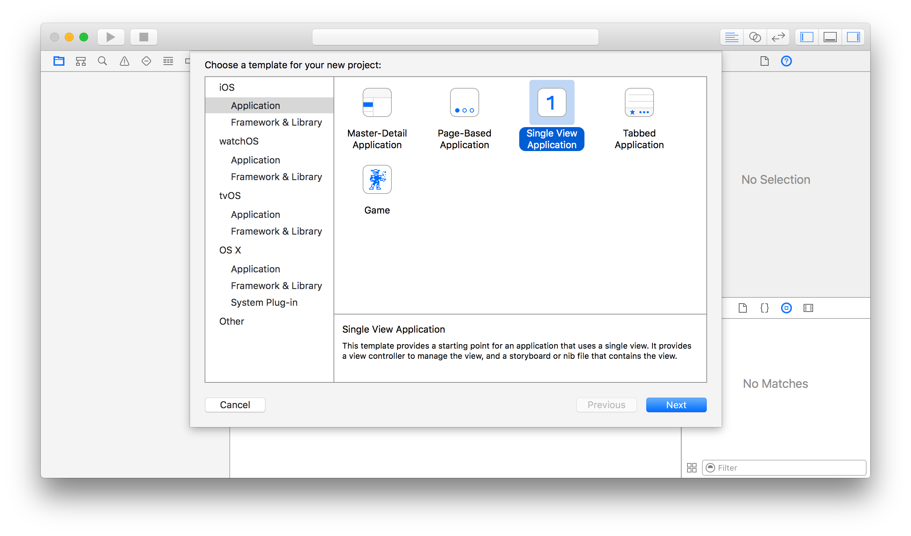  
   * "ImportSDKDemo" will be used as the **Product Name**.
   * Other settings can remain as default.
      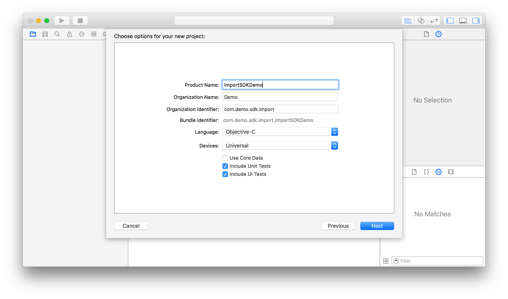

### Install SDK with CocoaPods in the Project

   * In Finder, navigate to the root folder of the project, and create a **Podfile**. To learn more about Cocoapods, please check [this guide](https://guides.cocoapods.org/using/getting-started.html#getting-started).
   * Replace the content of the **Podfile** with the followings:

   ~~~
    # platform :ios, '9.0'

    target 'ImportSDKDemo' do
    pod 'DJI-SDK-iOS', '~> 4.0’
    end
   ~~~

   * Run the following command in the root folder path:

   ~~~
    pod install
   ~~~

   * If you install the SDK successfully, you should get the messages similar to the following:

   ~~~
    Analyzing dependencies
    Downloading dependencies
    Installing DJI-SDK-iOS (4.0)
    Generating Pods project
    Integrating client project

    [!] Please close any current Xcode sessions and use `ImportSDKDemo.xcworkspace` for this project from now on.
    Pod installation complete! There is 1 dependency from the Podfile and 1 total pod
    installed.
   ~~~

   * The DJI SDK framework should now be downloaded and placed in the `Pods/DJI-SDK-iOS/iOS_Mobile_SDK/DJISDK.framework` path.

### Configure Build Settings

   * Open the **ImportSDKDemo.xcworkspace** file in Xcode.
   * For DJI products that connect to the mobile device through USB, add the "Supported external accessory protocols" key to the **info.plist** file, and add the strings "com.dji.video", "com.dji.protocol" and "com.dji.common" to the key.
   
   * Since iOS 9, App Transport Security has blocked cleartext HTTP (http://) resource loading. The "App Transport Security Settings" key must be added and "Allow Arbitrary Loads" must be set to "YES".
   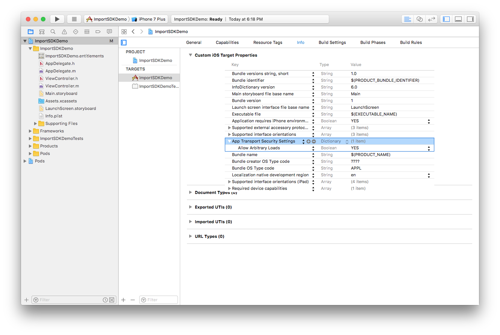
   * Currently the DJI iOS SDK doesn't support **Bitcode** for iOS device, please modify the Build Settings to disable it.
   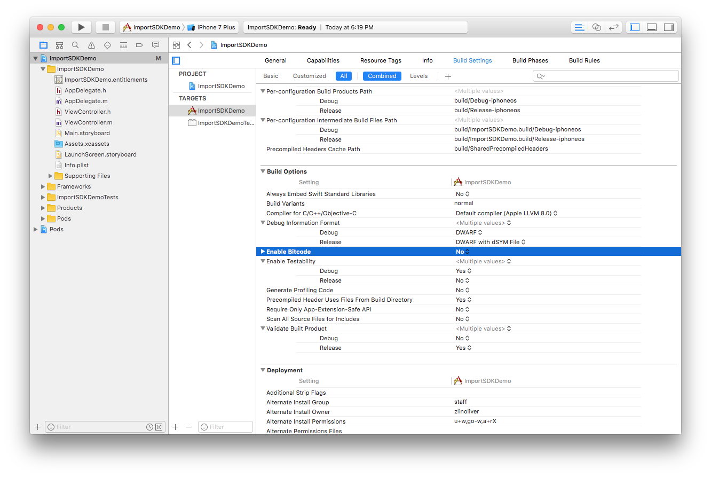

### Register Application

   * Import the DJI SDK header file into `ViewController.m`.
   * Give the view controller the `DJISDKManagerDelegate` protocol to follow.

~~~objc
#import "ViewController.h"
#import <DJISDK/DJISDK.h>

@interface ViewController ()<DJISDKManagerDelegate>
@end
~~~

   * Create a new method `registerApp`.
   * Use the application's Bundle Identifier to [generate an App Key](../quick-start/index.html#Generate-an-App-Key).
   * Create a `DJISDKAppKey` key in the **info.plist** file of the Xcode project and paste the generated App Key string into its string value:

   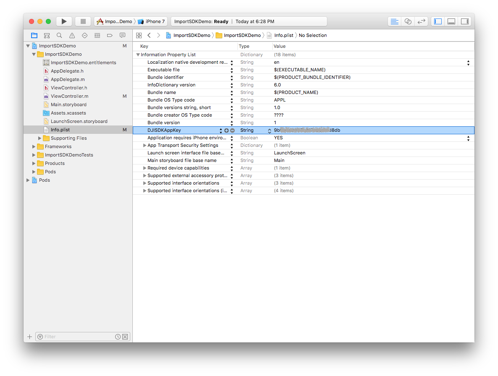

   * Invoke `registerApp` in `viewDidAppear` as shown below:

~~~objc
- (void)viewDidAppear:(BOOL)animated
{
    [super viewDidAppear:animated];
    [self registerApp];
}

- (void)registerApp
{
   [DJISDKManager registerAppWithDelegate:self];
}
~~~

   * The `DJISDKManagerDelegate` protocol requires the`appRegisteredWithError` method to be implemented.
   * Additionally implement `showAlertViewWithTitle` to give the registration result in a simple view.

~~~objc
- (void)appRegisteredWithError:(NSError *)error
{
    NSString* message = @"Register App Successed!";
    if (error) {
        message = @"Register App Failed! Please enter your App Key in the plist file and check the network.";
    }else
    {
        NSLog(@"registerAppSuccess");
    }
    
    [self showAlertViewWithTitle:@"Register App" withMessage:message];
}

- (void)showAlertViewWithTitle:(NSString *)title withMessage:(NSString *)message
{
    UIAlertController *alert = [UIAlertController alertControllerWithTitle:title message:message preferredStyle:UIAlertControllerStyleAlert];
    UIAlertAction *okAction = [UIAlertAction actionWithTitle:@"OK" style:UIAlertActionStyleDefault handler:nil];
    [alert addAction:okAction];
    [self presentViewController:alert animated:YES completion:nil];
}
~~~

### Run Import SDK Demo

The **ImportSDKDemo** project can now be run. You can download the sample code of this project from <a href="https://github.com/DJI-Mobile-SDK-Tutorials/iOS-ImportAndActivateSDKInXcode" target="_blank">Github</a>.

As this application is only checking for registration and not interacting directly with a product, no product needs to be connected to the application for this to run. Therefore, the application can either be run on a mobile device (with or without a DJI product connected) or in the iOS simulator. The application will need internet connectivity to perform registration successfully.

If the App Key was generated correctly and the iOS simulator or mobile device has internet connectivity, then the following should be seen:

   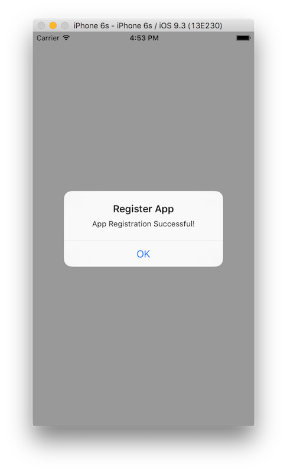

## Android Studio Project Integration

Screenshots in this section are generated using Android Studio 2.1.

### Create a New Application

A new application can be used to show how to integrate the DJI SDK into an Android Studio project.

   * Open Android Studio and at the initial screen select **Start a new Android Studio project**
   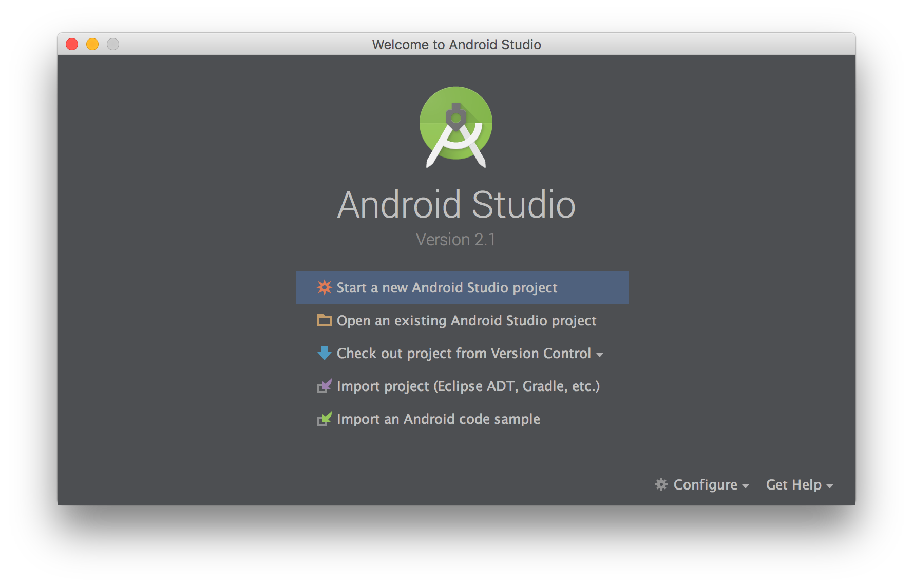

   * In the **New Project** screen:
      * Set the **Application name** to "ImportSDKDemo".
      * Set the **Company Domain** and **Package name** to "com.dji.ImportSDKDemo".
   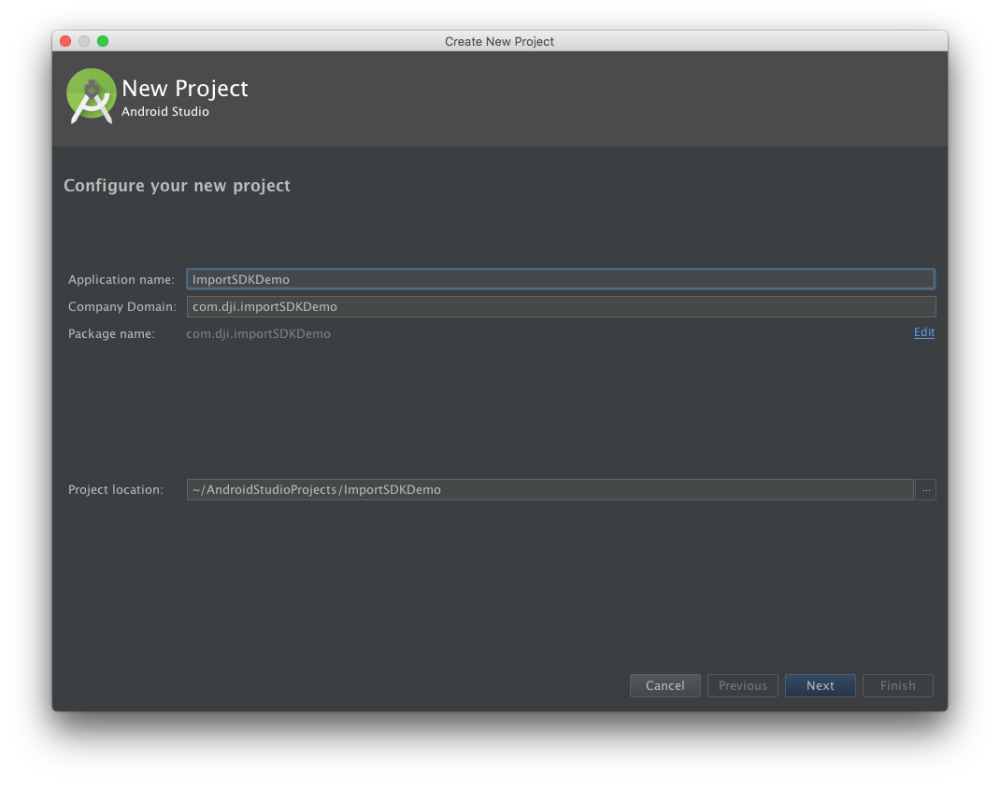

> **Note:** **Package name** is the identifying string required to [generate an App Key](../quick-start/index.html#Generate-an-App-Key).
> The activity java, manifest xml and Gradle script code below assumes **Package name** is "com.dji.ImportSDKDemo"

   * In the **Target Android Devices** screen:
     - Select **Phone and Tablet** form factor.
     - Choose **API 19: Android 4.4 (KitKat)**.
   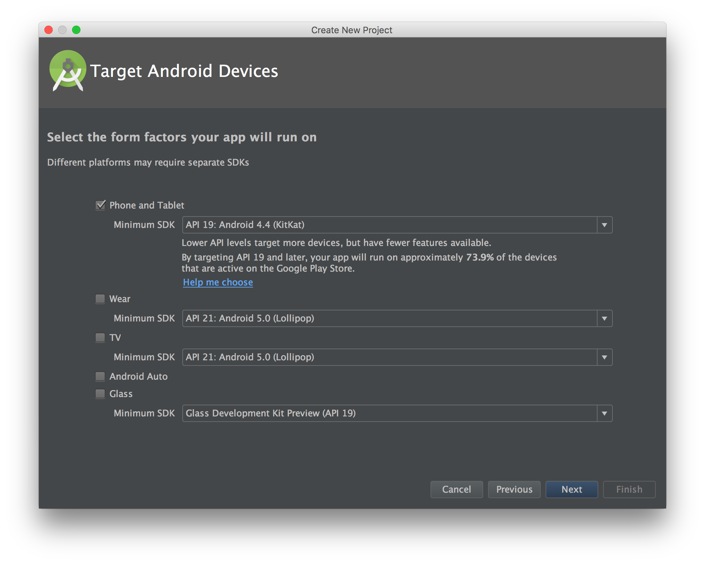

   * In the **Add an Activity to Mobile** screen choose **Empty Activity**.
   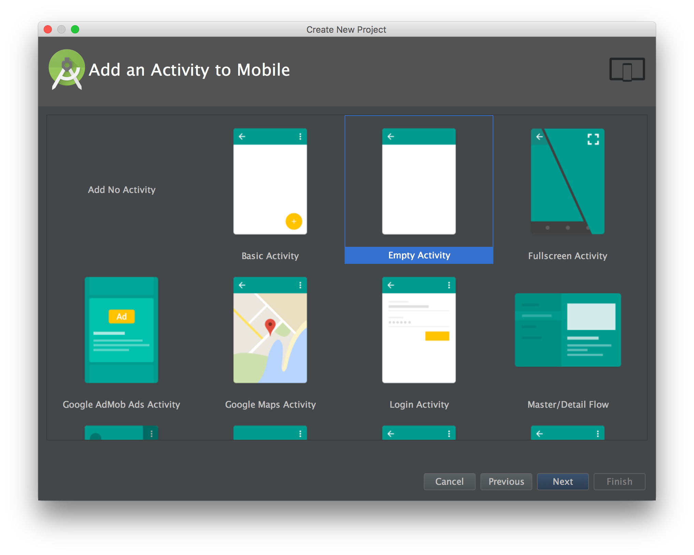

   * In the **Customize the Activity** screen:
      * Set **Activity Name:** to "MainActivity".
      * Ensure **Generate Layout File** is checked.
      * Set **Layout Name:** to "activity_main".
      * Click **Finish** when done.
   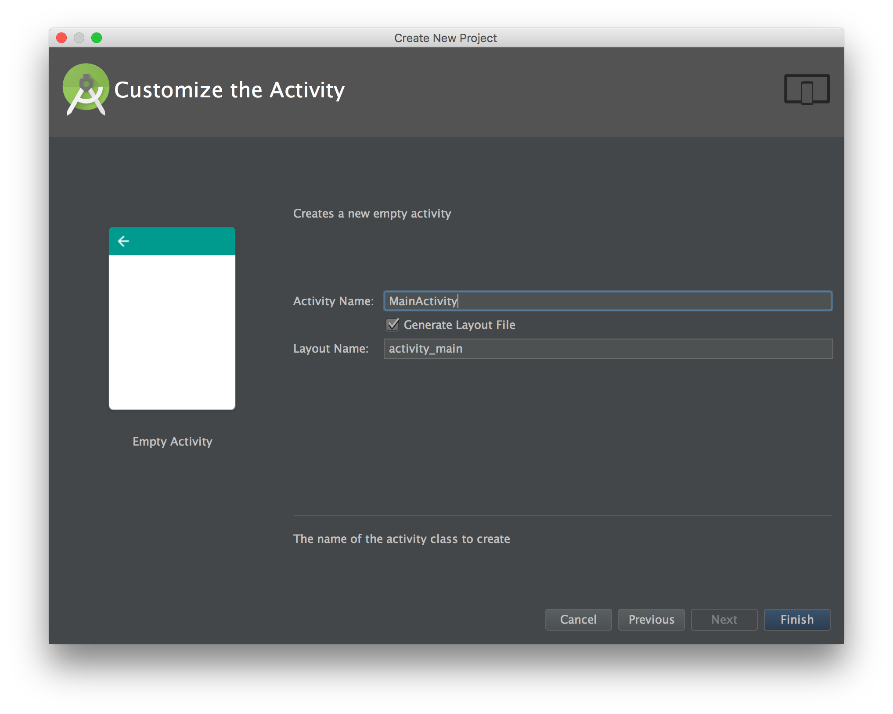

### Import Module

After unzipping the downloaded Android SDK package:

   * In the Android Studio menu bar select **File->New->Import Module**
   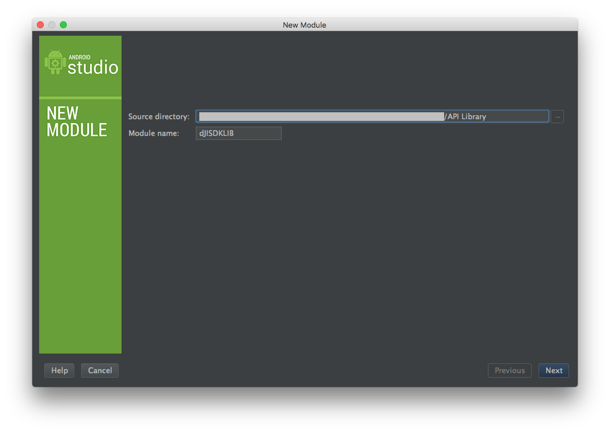
   * Move to the next screen, and finish import.
   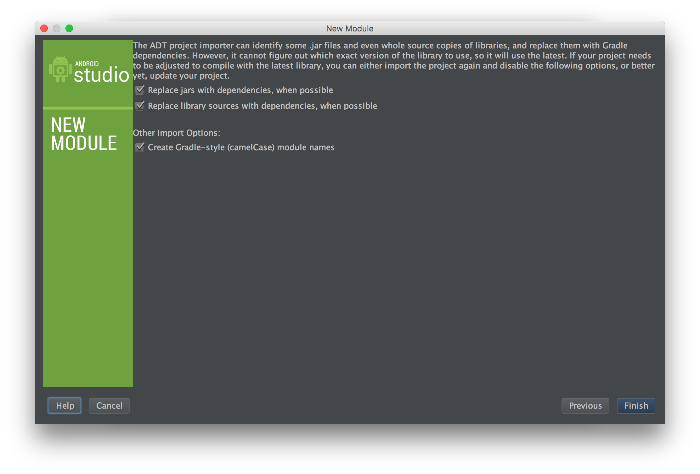

### Configure Gradle Script

  * In **Gradle Scripts** double click on **build.gradle (Module: app)**
  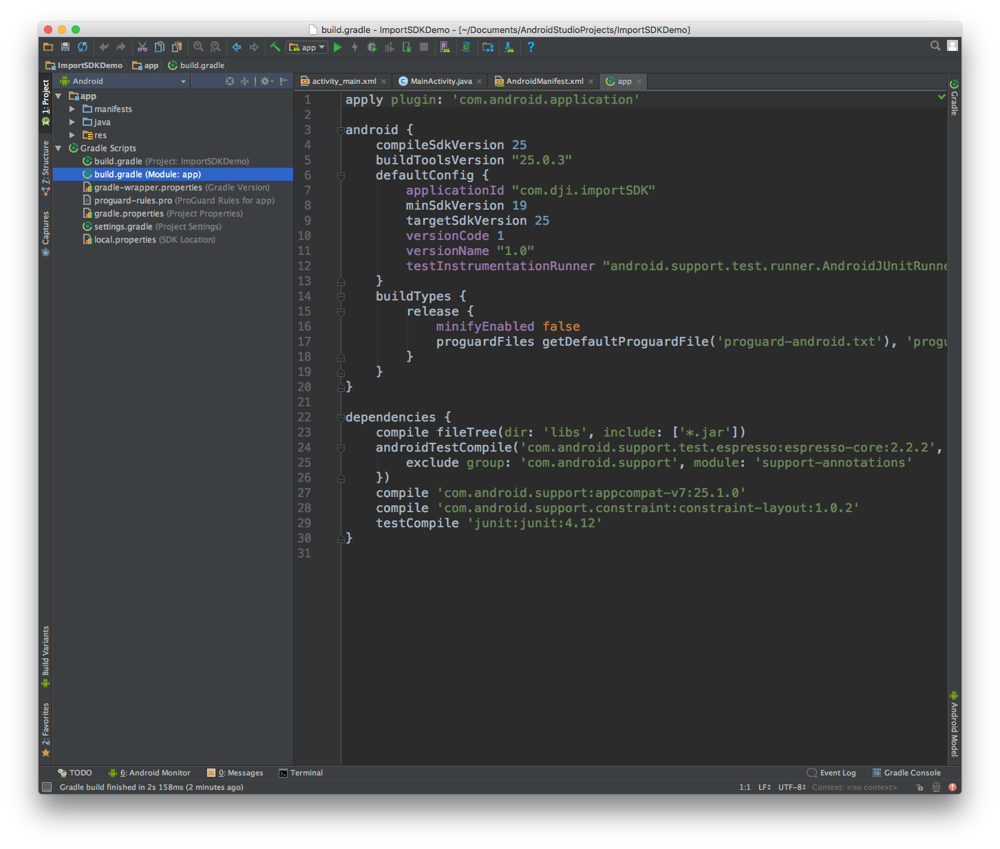
  * Replace the script with:

~~~java
apply plugin: 'com.android.application'

android {
    compileSdkVersion 23
    buildToolsVersion "23.0.1"

    defaultConfig {
        applicationId "com.dji.importSDKDemo"
        minSdkVersion 19
        targetSdkVersion 23
        versionCode 1
        versionName "1.0"
        multiDexEnabled true

    }
    buildTypes {
        release {
            minifyEnabled false
            proguardFiles getDefaultProguardFile('proguard-android.txt'), 'proguard-rules.pro'
        }
    }
}

dependencies {
    compile fileTree(dir: 'libs', include: ['*.jar'])
    compile 'com.android.support:appcompat-v7:23.3.0'
    compile 'com.android.support:design:23.3.0'
    compile 'com.android.support:multidex:1.0.1'
    compile project(':dJISDKLIB')  // <------------

}
~~~

* The main changes should be:
   * Add `compile project(':dJISDKLIB')` to the **dependencies**.
   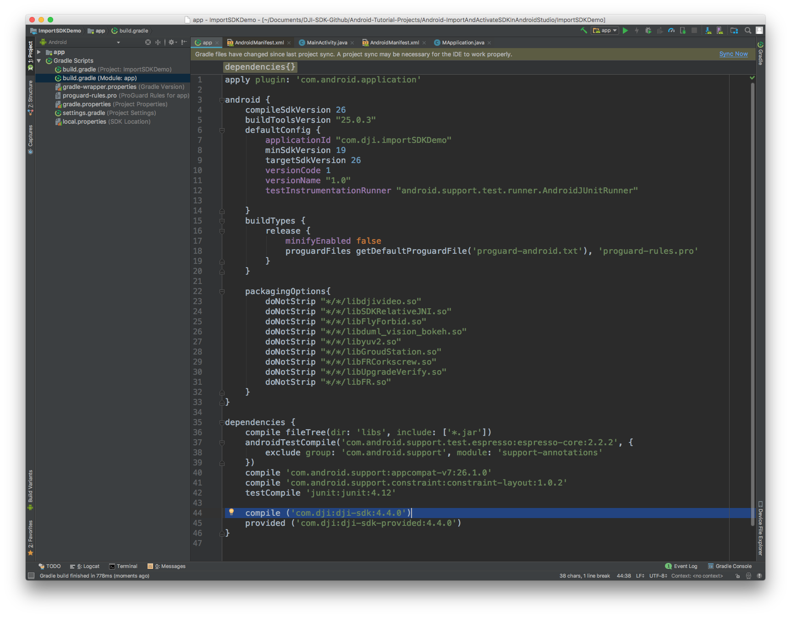
   * Select **Tools -> Android -> Sync Project with Gradle Files** and wait for Gradle project sync to finish.
   * Right click on **app** module in the project navigator and go to **Open Module Settings**.
   
   * Select **app** module on the left, and **Dependencies** on the top tab to confirm "djiSDKLIB" appears in the list.
   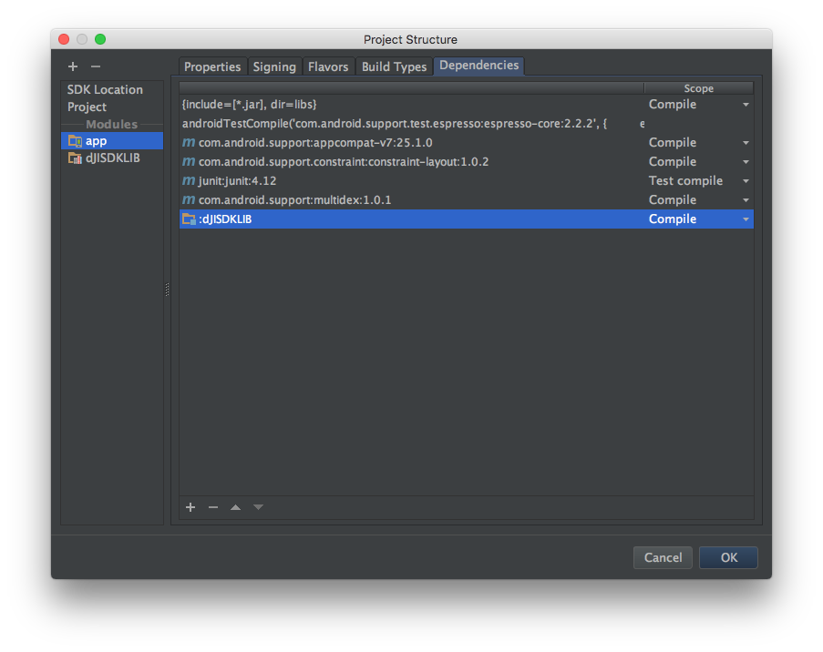

### Implement App Registration and SDK Callbacks

Double click on **MainActivity.java** in the **app** module.
   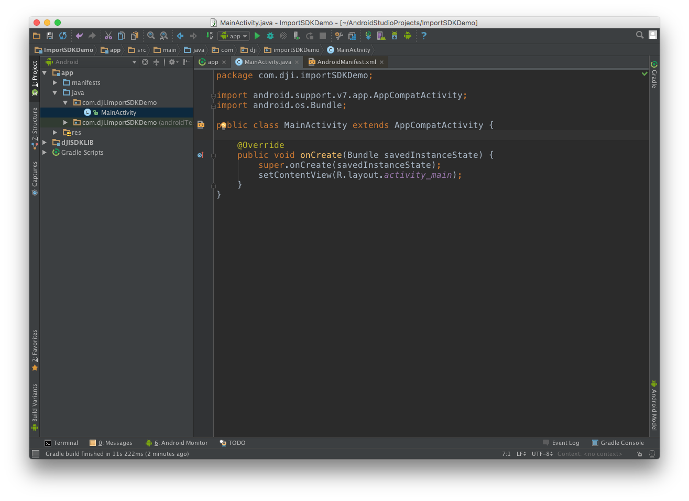
To import additional Android and DJI SDK classes that will be needed for the registration demonstration, add the following after `import android.os.Bundle;`:

~~~java
import android.content.Intent;
import android.os.Handler;
import android.os.Looper;
import android.util.Log;
import android.widget.Toast;

import dji.common.error.DJIError;
import dji.common.error.DJISDKError;
import dji.sdk.base.BaseComponent;
import dji.sdk.base.BaseProduct;
import dji.sdk.sdkmanager.DJISDKManager;
~~~

The MainActivity class needs to register the application to get authorization to use the DJI Mobile SDK. It also needs to implement callback methods expected by the SDK.

The MainActivity class will first be modified to include four class variables including `mProduct` which is the object that represents the DJI product connected to the mobile device. Additionally the `onCreate` method will be modified to instantiate the DJISDKManager.

Replace the MainActivity class with:

~~~java
public class MainActivity extends AppCompatActivity {

    private static final String TAG = MainActivity.class.getName();
    public static final String FLAG_CONNECTION_CHANGE = "dji_sdk_connection_change";
    private static BaseProduct mProduct;
    private Handler mHandler;

    @Override
    protected void onCreate(Bundle savedInstanceState) {
        super.onCreate(savedInstanceState);
        setContentView(R.layout.activity_main);

        //Initialize DJI SDK Manager
        mHandler = new Handler(Looper.getMainLooper());
        DJISDKManager.getInstance().registerApp(this, mDJISDKManagerCallback);
    }
}
~~~

 DJISDKManager has a callback that needs to process two methods for processing the application registration result, and for when the product connected to the mobile device is changed.

Add the DJISDKManager callback and implementations of `onGetRegisteredResult` and `onProductChanged`.

~~~java
  private DJISDKManager.SDKManagerCallback mDJISDKManagerCallback = new DJISDKManager.SDKManagerCallback() {

      @Override
      public void onRegister(DJIError error) {
          Log.d(TAG, error == null ? "success" : error.getDescription());
          if(error == DJISDKError.REGISTRATION_SUCCESS) {
              DJISDKManager.getInstance().startConnectionToProduct();
              Handler handler = new Handler(Looper.getMainLooper());
              handler.post(new Runnable() {

                  @Override
                  public void run() {
                      Toast.makeText(getApplicationContext(), "Register Success", Toast.LENGTH_LONG).show();
                  }
              });
          } else {
              Handler handler = new Handler(Looper.getMainLooper());
              handler.post(new Runnable() {

                  @Override
                  public void run() {
                      Toast.makeText(getApplicationContext(), "register sdk failed, check if network is available", Toast.LENGTH_LONG).show();
                  }
              });

          }
          Log.e("TAG", error.toString());
      }

      @Override
      public void onProductChange(BaseProduct oldProduct, BaseProduct newProduct) {

          mProduct = newProduct;
          if(mProduct != null) {
              mProduct.setBaseProductListener(mDJIBaseProductListener);
          }

          notifyStatusChange();
      }
  };
~~~

Finally methods for `DJIBaseProductListener`, `DJIComponentListener`, `notifyStatusChange` and `Runnable` need to be implemented :

~~~java
private BaseProduct.BaseProductListener mDJIBaseProductListener = new BaseProduct.BaseProductListener() {

    @Override
    public void onComponentChange(BaseProduct.ComponentKey key, BaseComponent oldComponent, BaseComponent newComponent) {
        if(newComponent != null) {
            newComponent.setComponentListener(mDJIComponentListener);
        }
        notifyStatusChange();
    }

    @Override
    public void onConnectivityChange(boolean isConnected) {
        notifyStatusChange();
    }

};

private BaseComponent.ComponentListener mDJIComponentListener = new BaseComponent.ComponentListener() {

    @Override
    public void onConnectivityChange(boolean isConnected) {
        notifyStatusChange();
    }

};

private void notifyStatusChange() {
    mHandler.removeCallbacks(updateRunnable);
    mHandler.postDelayed(updateRunnable, 500);
}

private Runnable updateRunnable = new Runnable() {

    @Override
    public void run() {
        Intent intent = new Intent(FLAG_CONNECTION_CHANGE);
        sendBroadcast(intent);
    }
};
~~~

The application must be granted permissions to in order for the DJI SDK to operate.

   * Double click on **AndroidManifest.xml** in the **app** module.
   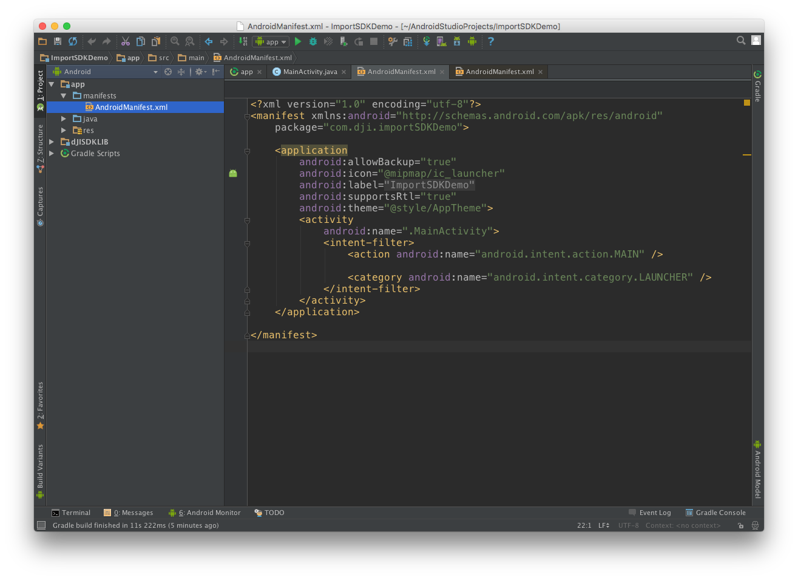
   * After `package=com.dji.ImportSDKDemo` and before `<application` insert:

~~~objc
<!-- Permissions and features -->
<uses-sdk />

<uses-permission android:name="android.permission.VIBRATE" />
<uses-permission android:name="android.permission.INTERNET" />
<uses-permission android:name="android.permission.ACCESS_WIFI_STATE" />
<uses-permission android:name="android.permission.WAKE_LOCK" />
<uses-permission android:name="android.permission.ACCESS_COARSE_LOCATION" />
<uses-permission android:name="android.permission.ACCESS_NETWORK_STATE" />
<uses-permission android:name="android.permission.ACCESS_FINE_LOCATION" />
<uses-permission android:name="android.permission.CHANGE_WIFI_STATE" />
<uses-permission android:name="android.permission.MOUNT_UNMOUNT_FILESYSTEMS" />
<uses-permission android:name="android.permission.WRITE_EXTERNAL_STORAGE" />
<uses-permission android:name="android.permission.READ_EXTERNAL_STORAGE" />
<uses-permission android:name="android.permission.SYSTEM_ALERT_WINDOW" />
<uses-permission android:name="android.permission.READ_PHONE_STATE" />

<uses-feature android:name="android.hardware.camera" />
<uses-feature android:name="android.hardware.camera.autofocus" />
<uses-feature
    android:name="android.hardware.usb.host"
    android:required="false" />
<uses-feature
    android:name="android.hardware.usb.accessory"
    android:required="true" />
<!-- Permissions and features -->
~~~

Insert the following after `android:theme="@style/AppTheme">` and before `<activity android:name=".MainActivity">`:

~~~xml
<!-- DJI SDK -->
    <uses-library android:name="com.android.future.usb.accessory" />
    <meta-data
        android:name="com.dji.sdk.API_KEY"
        android:value="Please enter your App Key here." />
    <activity
        android:name="dji.sdk.sdkmanager.DJIAoaControllerActivity"
        android:theme="@android:style/Theme.Translucent" >
        <intent-filter>
            <action android:name="android.hardware.usb.action.USB_ACCESSORY_ATTACHED" />
        </intent-filter>
        <meta-data
            android:name="android.hardware.usb.action.USB_ACCESSORY_ATTACHED"
            android:resource="@xml/accessory_filter" />
    </activity>
    <service android:name="dji.sdk.sdkmanager.DJIGlobalService" >
    </service>
<!-- DJI SDK -->
~~~

[Generate an App Key](../quick-start/index.html#Generate-an-App-Key), and replace "Please enter your App Key here." with the App Key string.

### Run Import SDK Demo

The **ImportSDKDemo** project can now be run. You can download the sample code of this project from <a href="https://github.com/DJI-Mobile-SDK-Tutorials/Android-ImportAndActivateSDKInAndroidStudio" target="_blank">Github</a>.

As this application is only checking for registration and not interacting directly with a product, no product needs to be connected to the application for this to run. Therefore, the application can either be run on a mobile device (with or without a DJI product connected) or in the Android simulator. The application will need internet connectivity to perform registration successfully.

If the App Key was generated correctly and the Android simulator or mobile device has internet connectivity, then the following should be seen:

 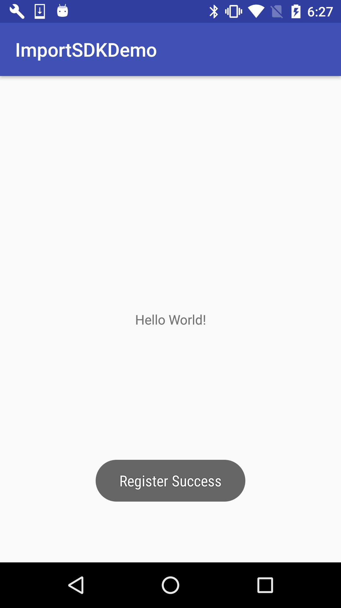

### FFmpeg License

The DJI Android SDK is dynamically linked with unmodified libraries of <a href=http://ffmpeg.org>FFmpeg</a> licensed under the <a href=http://www.gnu.org/licenses/old-licenses/lgpl-2.1.html>LGPLv2.1</a>. The source code of these FFmpeg libraries, the compilation instructions, and the LGPL v2.1 license are provided in [Github](https://github.com/dji-sdk/FFmpeg).

