<!-- toc -->

*If you come across any mistakes or bugs in this tutorial, please let us know using a Github issue, a post on the DJI forum. Please feel free to send us Github pull request and help us fix any issues.*

---

In this tutorial, you will learn how to build a cool panorama app. With the help of the powerful DJI Mobile SDK and OpenCV libraries, it is actually easy. You will use the Waypoint feature of Intelligent Navigation and Virtual Stick to rotate the aircraft to take photos. The panorama application can be broken down into several simple tasks, all you need to do is to follow the tutorial step by step. Let's get started!

You can download the tutorial's final sample code project from this [Github Page](https://github.com/DJI-Mobile-SDK-Tutorials/iOS-PanoramaDemo).

## Application Activation and Aircraft Binding in China

 For DJI SDK mobile application used in China, it's required to activate the application and bind the aircraft to the user's DJI account. 

 If an application is not activated, the aircraft not bound (if required), or a legacy version of the SDK (< 4.1) is being used, all **camera live streams** will be disabled, and flight will be limited to a cylinder of 100m diameter and 30m height to ensure the aircraft stays within line of sight.

 To learn how to implement this feature, please check this tutorial [Application Activation and Aircraft Binding](./ActivationAndBinding.html).

## Implementing the FPV

**1.** Now, let's create a new project in Xcode, choose **Single View Application** template for your project and press "Next", then enter "PanoDemo" in the **Product Name** field and keep the other default settings.

Once the project is created, let's import the **DJISDK.framework** to the project. If you are not familiar with the process of importing DJI SDK using Cocoapods, please check this tutorial: [Importing and Activating DJI SDK in Xcode Project](../application-development-workflow/workflow-integrate.html#Xcode-Project-Integration) 

For importing the VideoPreviewer to the project, you can check our previous tutorial [Creating a Camera Application](./index.html#Implementing-the-First-Person-View) to learn how to download and import the **VideoPreviewer** into your Xcode project.

**2.** In the **Main.storyboard**, add a new View Controller called **CaptureViewController** and set it as the root View Controller for the new View Controller you just added in **Main.storyboard**:

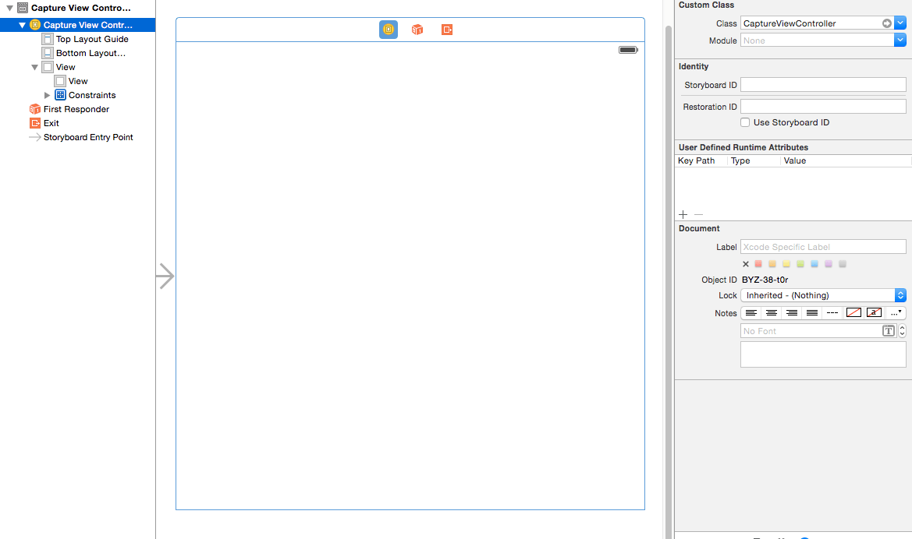

**3.** Add a UIView inside the View Controller and set it as an IBOutlet called "**fpvPreviewView**" in the **CaptureViewController.h**:

~~~objc
#import <UIKit/UIKit.h>

@interface CaptureViewController : UIViewController
@property (strong, nonatomic) IBOutlet UIView *fpvPreviewView;
@end
~~~

Import the **DJISDK** and **VideoPreviewer** header files to **CaptureViewController.m**. Then implement two delegate protocols as shown below:
    
~~~objc
#import "CaptureViewController.h"
#import <DJISDK/DJISDK.h>
#import <VideoPreviewer/VideoPreviewer.h>

#define weakSelf(__TARGET__) __weak typeof(self) __TARGET__=self
#define weakReturn(__TARGET__) if(__TARGET__==nil)return;

@interface CaptureViewController ()<DJICameraDelegate, DJIVideoFeedListener, DJISDKManagerDelegate>{

~~~
 
**4**. In the **viewDidLoad** method, set **fpvPreviewView** instance as a view of **VideoPreviewer** to show the Video Stream, then invoke the **registerApp** method to register the app:
 
~~~objc
- (void)viewDidLoad {
    [super viewDidLoad];
    
    self.title = @"Panorama Demo";
    [[VideoPreviewer instance] setView:self.fpvPreviewView];
    [self registerApp];

}

- (void) registerApp {
    //Please enter the App Key in the info.plist file to register the App.
    [DJISDKManager registerAppWithDelegate:self];
}
~~~

Also, implement the DJISDKManagerDelegate methods to do initial setup after register app success. Moreover, in the `productConnected:` method, let's fetch a camera object and set its delegate and its playbackManager property's delegate as shown below:

~~~objc

- (void)showAlertViewWithTitle:(NSString *)title withMessage:(NSString *)message
{
    UIAlertController *alert = [UIAlertController alertControllerWithTitle:title message:message preferredStyle:UIAlertControllerStyleAlert];
    UIAlertAction *okAction = [UIAlertAction actionWithTitle:@"OK" style:UIAlertActionStyleDefault handler:nil];
    [alert addAction:okAction];
    [self presentViewController:alert animated:YES completion:nil];
}

- (DJICamera*) fetchCamera {
    
    if (![DJISDKManager product]) {
        return nil;
    }
    return [DJISDKManager product].camera;
}

#pragma mark DJISDKManagerDelegate Method

- (void)appRegisteredWithError:(NSError *)error {

    NSString* message = @"Register App Successfully!";
    if (error) {
        message = @"Register App Failed! Please enter your App Key and check the network.";
    }else{
        NSLog(@"registerAppSuccess");
        
        [DJISDKManager startConnectionToProduct];
        [[DJISDKManager videoFeeder].primaryVideoFeed addListener:self withQueue:nil];
        [[VideoPreviewer instance] start];
    }
    
    [self showAlertViewWithTitle:@"Register App" withMessage:message];
    
}

- (void)productConnected:(DJIBaseProduct *)product
{
    if (product) {
        DJICamera* camera = [self fetchCamera];
        if (camera != nil) {
            camera.delegate = self;
            [camera.playbackManager setDelegate:self];
        }
    }
}

~~~

 Furthermore, implement the **DJIVideoFeedListener** delegate method, as shown below:
  
~~~objc
  
#pragma mark - DJIVideoFeedListener
-(void)videoFeed:(DJIVideoFeed *)videoFeed didUpdateVideoData:(NSData *)videoData {
    [[VideoPreviewer instance] push:(uint8_t *)videoData.bytes length:(int)videoData.length];
}

~~~

**5.** Build and run the project on your mobile device, then connect your device to the aircraft. Now you can see view the camera's video stream on your device.

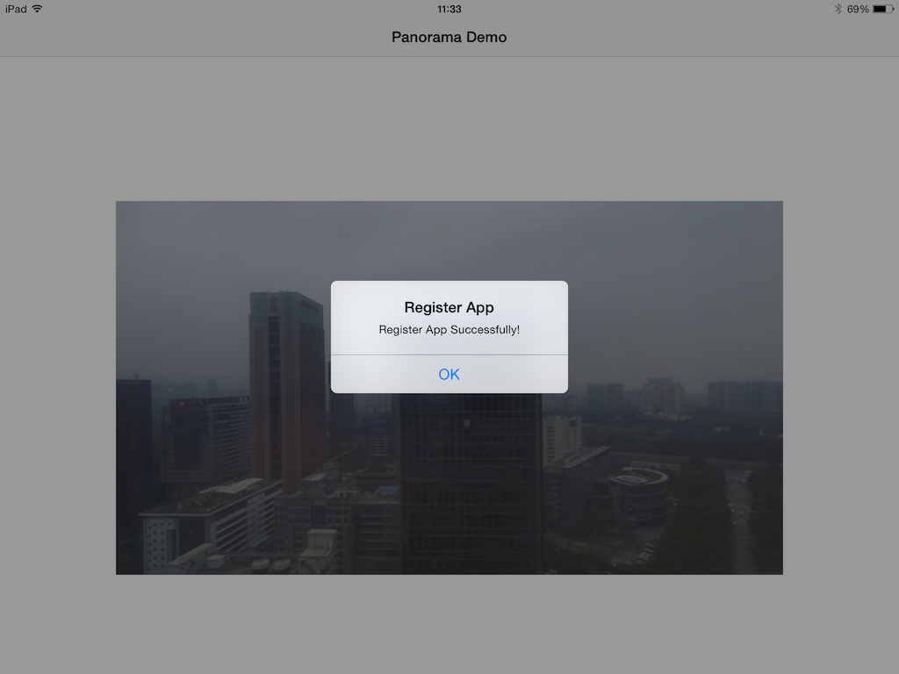

## Rotating with Virtual Stick

In order to generate a panorama, you need to take a series of photos from different angles while keeping the center of the drone still. This is easy to do with the gimbal on Inspire 1, but with the Phantom 4 you cannot control the gimbal's yaw angle using our SDK. Instead we will rotate the entire drone. Here's the instruction.

**1.** Add a **Capture** button in **Capture View Controller** in **Main.storyboard**. Name its **IBOutlet** as **captureBtn** respectively, and its **IBAction** as **-(IBAction)onCaptureButtonClicked:(id)sender**.

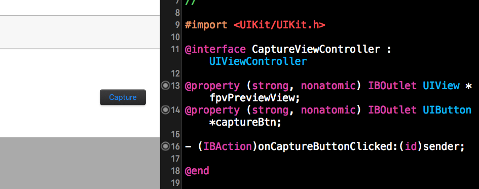

**2.** Next, let's define the angle for each rotation and invoke the **rotateDroneWithJoystick** method in  **-(IBAction)onCaptureButtonClicked:(id)sender**:

~~~~objc
#define PHOTO_NUMBER 8
#define ROTATE_ANGLE 45.0
~~~~

~~~objc
-(IBAction)onCaptureButtonClicked:(id)sender {
    [self rotateDroneWithJoystick];
}
~~~

Furthermore, implement the `-(DJIFlightController*) fetchFlightController` method and configure the DJIFlightController object in the following **DJISDKManagerDelegate** method:

~~~objc

- (DJIFlightController*) fetchFlightController {
    if (![DJISDKManager product]) {
        return nil;
    }
    if ([[DJISDKManager product] isKindOfClass:[DJIAircraft class]]) {
        return ((DJIAircraft*)[DJISDKManager product]).flightController;
    }
    return nil;
}

- (void)productConnected:(DJIBaseProduct *)product
{
    if (product) {
        DJICamera* camera = [self fetchCamera];
        if (camera != nil) {
            camera.delegate = self;
            [camera.playbackManager setDelegate:self];
        }
    }
    
    DJIFlightController *flightController = [self fetchFlightController];
    if (flightController) {
        [flightController setDelegate:self];
        [flightController setYawControlMode:DJIVirtualStickYawControlModeAngle];
        [flightController setRollPitchCoordinateSystem:DJIVirtualStickFlightCoordinateSystemGround];
        
        [flightController setVirtualStickModeEnabled:YES withCompletion:^(NSError * _Nullable error) {
            if (error) {
                NSLog(@"Enable VirtualStickControlMode Failed");
            }
        }];
    }
}
~~~

As the code shown above, we configure the flightController's **delegate**, and **yawControlMode** properties. Then invoke the `setVirtualStickModeEnabled:withCompletion:` method to prepare for the virtual stick control.

**3.** Using the flightController virtual stick api is similar to sending commands using your remote controller. The virtual stick api can be used to directly specify the pitch, roll, yaw and throttle values of the drone and must be called with a certain frequency(Like 10 Hz) determined by the drone's flight controller, otherwise the flight controller will assume that the connection is lost, and the command may not be executed successfully. Hense, we should use a NSTimer to send virtual stick command in 10Hz as shown below:

~~~objc
- (void)rotateDroneWithJoystick
{

   for(int i = 0;i < PHOTO_NUMBER; i++){
    
     float yawAngle = ROTATE_ANGLE*i;
    
     if (yawAngle > 180) { //Filter the angle between -180 ~ 0, 0 ~ 180
        yawAngle = yawAngle - 360;
     }
    
    NSTimer *timer =  [NSTimer scheduledTimerWithTimeInterval:0.1 target:self selector:@selector(rotateDrone:) userInfo:@{@"YawAngle":@(yawAngle)} repeats:YES];
    [timer fire];
    
    [[NSRunLoop currentRunLoop]addTimer:timer forMode:NSDefaultRunLoopMode];
    [[NSRunLoop currentRunLoop]runUntilDate:[NSDate dateWithTimeIntervalSinceNow:2]];
    
    [timer invalidate];
    timer = nil;
   }

}

- (void)rotateDrone:(NSTimer *)timer
{
    NSDictionary *dict = [timer userInfo];
    float yawAngle = [[dict objectForKey:@"YawAngle"] floatValue];
    
    DJIFlightController *flightController = [self fetchFlightController];

    DJIVirtualStickFlightControlData vsFlightCtrlData;
    vsFlightCtrlData.pitch = 0;
    vsFlightCtrlData.roll = 0;
    vsFlightCtrlData.verticalThrottle = 0;
    vsFlightCtrlData.yaw = yawAngle;
    
    flightController.isVirtualStickAdvancedModeEnabled = YES;

    [flightController sendVirtualStickFlightControlData:vsFlightCtrlData withCompletion:^(NSError * _Nullable error) {
        if (error) {
            NSLog(@"Send FlightControl Data Failed %@", error.description);
        }
    }];

}
~~~

You can set up the virtual stick flight control data by setting a **DJIVirtualStickFlightControlData** structure. As the code shows above, it use a for loop to control the drone to rotate 45 degrees for 8 times, each time the yawAngle will be updated, and assign its value to the corresponding yaw value of **DJIVirtualStickFlightControlData**:

~~~objc
- (void)sendVirtualStickFlightControlData:(DJIVirtualStickFlightControlData)controlData withCompletion:(DJICompletionBlock)completion;
~~~

Also, for DJI Products which have collision avoidance feature, like Phantom 4, Mavic Pro, Spark, etc, we can enable the collision avoidance for virtual stick control by setting `YES` to the `isVirtualStickAdvancedModeEnabled` property of DJIFlightController as shown below:

~~~objc
flightController.isVirtualStickAdvancedModeEnabled = YES;
~~~

**4.** Now try to build and run the app, connect your mobile device to the remote controller, switch the flight mode to **F** (Function) mode, take off the drone and press the **Capture** button. You should see the drone rotates in 360 degrees, 45 degrees each time.

Here is the gif animation example of using DJI Assistant 2 Simulator to test this feature:

If you are not familiar with the DJI Assistant 2 Simulator, please check the [DJI Assistant 2 Simulator Tutorial](../application-development-workflow/workflow-testing.html#Using-DJI-Assistant-2).

## Shooting a Series of Photos

We can invoke the following DJICamera method to shoot photos:

~~~objc
- (void)startShootPhotoWithCompletion:(DJICompletionBlock)completion;
~~~

Let's implement the methods as shown below to make the drone shoot photos automatically once it finish 45 degrees' rotation each time:

~~~objc
#pragma mark - Rotate Drone With Joystick Methods
- (void)rotateDroneWithJoystick {
    
    if([[DJISDKManager product].model isEqual: DJIAircraftModelNameSpark])
    {
        weakSelf(target);
        [[DJISDKManager missionControl].activeTrackMissionOperator setGestureModeEnabled:NO withCompletion:^(NSError * _Nullable error) {
            weakReturn(target);
            if (error) {
                NSLog(@"Set Gesture mode enabled failed");
            }else{
                [target setCameraModeToShootPhoto];
            }
        }];
    }else{
        [self setCameraModeToShootPhoto];
    }
}

-(void)setCameraModeToShootPhoto {
    weakSelf(target);
    DJICamera *camera = [target fetchCamera];
    [camera getModeWithCompletion:^(DJICameraMode mode, NSError * _Nullable error) {
        if (error == nil) {
            if (mode == DJICameraModeShootPhoto) {
                [target enableVirtualStick];
            }
            else {
                [camera setMode:DJICameraModeShootPhoto withCompletion:^(NSError * _Nullable error) {
                    weakReturn(target);
                    if (error == nil) {
                        [target enableVirtualStick];
                    }
                }];
            }
        }
    }];
}

#pragma mark DJISDKManagerDelegate Methods
- (void)productConnected:(DJIBaseProduct *)product
{
    if (product) {
        DJICamera* camera = [self fetchCamera];
        if (camera != nil) {
            camera.delegate = self;
            [camera.playbackManager setDelegate:self];
        }
    }
    
    DJIFlightController *flightController = [self fetchFlightController];
    if (flightController) {
        [flightController setDelegate:self];
    }
}

-(void)enableVirtualStick {
    DJIFlightController *flightController = [self fetchFlightController];
    [flightController setYawControlMode:DJIVirtualStickYawControlModeAngle];
    [flightController setRollPitchCoordinateSystem:DJIVirtualStickFlightCoordinateSystemGround];
    [flightController setVirtualStickModeEnabled:YES withCompletion:^(NSError * _Nullable error) {
        if (error) {
            NSLog(@"Enable VirtualStickControlMode Failed");
        }
        dispatch_async(dispatch_get_global_queue(DISPATCH_QUEUE_PRIORITY_DEFAULT, 0), ^{
            [self executeVirtualStickControl];
        });
    }];
}

- (void)executeVirtualStickControl
{
    __weak DJICamera *camera = [self fetchCamera];

    for(int i = 0;i < PHOTO_NUMBER; i++){

        float yawAngle = ROTATE_ANGLE*i;

        if (yawAngle > 180.0) { //Filter the angle between -180 ~ 0, 0 ~ 180
            yawAngle = yawAngle - 360;
        }
        
        NSTimer *timer =  [NSTimer scheduledTimerWithTimeInterval:0.2 target:self selector:@selector(rotateDrone:) userInfo:@{@"YawAngle":@(yawAngle)} repeats:YES];
        [timer fire];
        
        [[NSRunLoop currentRunLoop]addTimer:timer forMode:NSDefaultRunLoopMode];
        [[NSRunLoop currentRunLoop]runUntilDate:[NSDate dateWithTimeIntervalSinceNow:2]];
        
        [timer invalidate];
        timer = nil;
        
        [camera startShootPhotoWithCompletion:nil];
        
        sleep(2);
    }

    DJIFlightController *flightController = [self fetchFlightController];
    [flightController setVirtualStickModeEnabled:NO withCompletion:^(NSError * _Nullable error) {
        if (error) {
            NSLog(@"Disable VirtualStickControlMode Failed");
            DJIFlightController *flightController = [self fetchFlightController];
            [flightController setVirtualStickModeEnabled:NO withCompletion:nil];
        }
    }];

    weakSelf(target);
    dispatch_async(dispatch_get_main_queue(), ^{
        weakReturn(target);
        [target showAlertViewWithTitle:@"Capture Photos" withMessage:@"Capture finished"];
    });
}

~~~

In the code above, we implement the following things:

1. We create the `rotateDroneWithJoystick` and `setCameraModeToShootPhoto` methods to make sure the current work mode of the camera is `DJICameraModeShootPhoto` in case it's set to other values before we start the 360 degrees panorama shoot photo action using virtual stick. Also, in the `rotateDroneWithJoystick` method, we firstly check if the current DJI Product is **DJI Spark**, if so, we invoke the `setGestureModeEnabled:withCompletion:` method of `DJIActiveTrackMissionOperator` to disable gesture mode since **DJI Spark** will enable it by default and the virtual stick control may not be available under gesture mode.

2. Then we refactor the `productConnected:` delegate method and create the `enableVirtualStick` method to configure the `yawControlMode`, `rollPitchCoordinateSystem` properties and enable the virtual stick mode of DJIFlightController.

3. Create the `executeVirtualStickControl` method and dispatch a new asynchronous thread to execute it in the completion block of `setVirtualStickModeEnabled:withCompletion:` method. In the `executeVirtualStickControl` method, we use `sleep(2)` to sleep for 2 seconds between rotating the drone and shooting photo actions here to ensure each action is executed ordered(Shoot photo action may take around 2 seconds to finish). When the for loop finished, we disable the virtual stick mode and show an alert view in the main thread to notify the user "Capture finished".

## Rotating Gimbal to Shoot Photos

If you have an Inspire 1, you will benefit from being able to shoot photos without moving the drone, taking advantage of the gimbal's 360 rotation capabilities. Rotating the gimbal while keeping the drone still in the air means you will have a stable photography platform, which helps you to create a wonderful panorama. Let's take a look at the implementation.

**1.** let's implement the `- (DJIGimbal*) fetchGimbal` method to fetch the gimbal component:

~~~objc
- (DJIGimbal*) fetchGimbal {
    if (![DJISDKManager product]) {
        return nil;
    }
    return [DJISDKManager product].gimbal;
}
~~~

**2.** Next, implement the **rotateGimbal** method as shown below to rotate the gimbal clockwise from the origin position to 360 degrees(45 degrees each time), then take photos between each rotation:

~~~objc
#pragma mark - Rotate Gimbal Methods
- (void)rotateGimbal {
    
    DJICamera *camera = [self fetchCamera];
    weakSelf(target);
    [camera setMode:DJICameraModeShootPhoto withCompletion:^(NSError * _Nullable error) {
        weakReturn(target);
        if (!error) {
            dispatch_async(dispatch_get_global_queue(DISPATCH_QUEUE_PRIORITY_DEFAULT, 0), ^{
                [target executeRotateGimbal];
            });
        }
    }];   
}

- (void)executeRotateGimbal
{
    
    DJIGimbal *gimbal = [self fetchGimbal];
    __weak DJICamera *camera = [self fetchCamera];
    
    //Reset Gimbal at the beginning
    [gimbal resetWithCompletion:^(NSError * _Nullable error) {
        if (error) {
            NSLog(@"ResetGimbal Failed: %@", [NSString stringWithFormat:@"%@", error.description]);
        }
    }];
    sleep(3);
    
    //rotate the gimbal clockwise
    float yawAngle = 0;
    
    for(int i = 0; i < PHOTO_NUMBER; i++){
        
        [camera setShootPhotoMode:DJICameraShootPhotoModeSingle withCompletion:^(NSError * _Nullable error) {
            dispatch_after(dispatch_time(DISPATCH_TIME_NOW, (int64_t)(1 * NSEC_PER_SEC)), dispatch_get_main_queue(), ^{
                [camera startShootPhotoWithCompletion:nil];
            });
        }];

        sleep(2);
        
        NSNumber *pitchRotation = @(0);
        NSNumber *rollRotation = @(0);
        NSNumber *yawRotation = @(yawAngle);
        
        yawAngle += ROTATE_ANGLE;
        if (yawAngle > 180.0) { //Filter the angle between -180 ~ 0, 0 ~ 180
            yawAngle = yawAngle - 360;
        }
        yawRotation = @(yawAngle);
        
        DJIGimbalRotation *rotation = [DJIGimbalRotation gimbalRotationWithPitchValue:pitchRotation rollValue:rollRotation                                                        yawValue:yawRotation time:1 mode:DJIGimbalRotationModeAbsoluteAngle];
        
        [gimbal rotateWithRotation:rotation completion:^(NSError * _Nullable error) {
            if (error) {
                NSLog(@"Rotate Gimbal Failed: %@", [NSString stringWithFormat:@"%@", error.description]);
            }
        }];
        
        sleep(2);
    }

    weakSelf(target);
    dispatch_async(dispatch_get_main_queue(), ^{
        weakReturn(target);
        [self showAlertViewWithTitle:@"Capture Photos" withMessage:@"Capture finished"];
    });
    
}
~~~

In the code above, we implement the following features:

1. Set the DJICamera's cameraMode to **DJICameraModeShootPhoto**, then dispatch a new asynchronous thread to execute the `executeRotateGimbal` method.

2. In the `executeRotateGimbal` method, reset Gimbal's position. It is necessary to reset the gimbal's position before rotating and shooting photos, otherwise the gimbal may reach the maximum angle of yaw axis when rotating 360 degrees.  

3. Use a for loop to shoot photo and rotate gimbal 45 degrees each time. When the for loop finished, we can show an alert view in the main thread to notify the user "Capture Photos finished".

**3.** Rewrite the **onCaptureButtonClicked** method as shown below:

~~~objc
-(IBAction)onCaptureButtonClicked:(id)sender {
   [self rotateGimbal];
}
~~~

Build and run the app, and try the capture button function of the app without taking off the Inspire 1. You should see the gimbal of Inspire 1 rotating 360 degrees and shoot photos smoothly.

## Shooting Photos with DJIMutableWaypointMission 

**Note: Please make sure the drone's battery energy percentage is more than 30% when you use DJIMutableWaypointMission**

It seems a bit inconvenient and odd to use `sleep(2)` between rotating the drone and shooting photos. Shouldn't there be an easier, more efficient way to implement this? Yes, the DJIMutableWaypointMission is designed for executing series of actions within different waypoints, which is perfect for our application!

**1.** To use the DJIMutableWaypointMission, firstly we should implement the **DJIFlightControllerDelegate** protocol in the class extension of **CaptureViewController.m** as shown below:

~~~objc
@interface CaptureViewController ()<DJICameraDelegate, DJIPlaybackDelegate, DJISDKManagerDelegate, DJIVideoFeedListener, DJIFlightControllerDelegate>{
    
}
~~~

Then declare the following properties for setting up DJIWaypointMission:

~~~objc
@property (strong, nonatomic) UIAlertView* uploadMissionProgressAlert;
@property (atomic) CLLocationCoordinate2D aircraftLocation;
@property (atomic) double aircraftAltitude;
@property (atomic) DJIGPSSignalLevel gpsSignalLevel;
@property (atomic) double aircraftYaw;
~~~

Here we create an **uploadMissionProgressAlert** to show the upload mission progress message. The "aircraftLocation", "aircraftAltitude", "gpsSignalLevel" and "aircraftYaw" properties will be updated as the latest flight controller system status of the drone.

Moreover, initialize the **aircraftLocation** property in the ViewDidLoad method:

~~~objc

- (void)viewDidLoad {
    [super viewDidLoad];
    
    self.title = @"Panorama Demo";
    self.aircraftLocation = kCLLocationCoordinate2DInvalid;
    [[VideoPreviewer instance] setView:self.fpvPreviewView];
    [self registerApp];

}

~~~

**2.** The **DJIFlightControllerDelegate** method need to be implemented:

~~~objc

#pragma mark - DJIFlightControllerDelegate Method
- (void)flightController:(DJIFlightController *_Nonnull)fc didUpdateState:(DJIFlightControllerState *_Nonnull)state
{
    self.aircraftLocation = CLLocationCoordinate2DMake(state.aircraftLocation.coordinate.latitude, state.aircraftLocation.coordinate.longitude);
    self.gpsSignalLevel = state.gpsSignalQualityLevel;
    self.aircraftAltitude = state.altitude;
    self.aircraftYaw = state.attitude.yaw;
}
~~~

As the code shown above, we update the **aircraftLocation**, **gpsSignalLevel**, **aircraftAltitude** and **aircraftYaw** property values in the DJIFlightControllerDelegate method.

**3.** Now let's create a new method named `missionOperator` method to fetch the `DJIWaypointMissionOperator` object and initialize the DJIMutableWaypointMission by creating a new method named `initializeMission ` as shown below:

~~~objc

- (DJIWaypointMissionOperator *)missionOperator {
    return [[DJISDKManager missionControl] waypointMissionOperator];
}

- (void) initializeMission {
    
    DJIMutableWaypointMission *mission = [[DJIMutableWaypointMission alloc] init];
    mission.maxFlightSpeed = 15.0;
    mission.autoFlightSpeed = 4.0;
    
    DJIWaypoint *wp1 = [[DJIWaypoint alloc] initWithCoordinate:self.aircraftLocation];
    wp1.altitude = self.aircraftAltitude;
    
    for (int i = 0; i < PHOTO_NUMBER ; i++) {
        
        double rotateAngle = ROTATE_ANGLE*i;
        
        if (rotateAngle > 180) { //Filter the angle between -180 ~ 0, 0 ~ 180
            rotateAngle = rotateAngle - 360;
        }
        
        DJIWaypointAction *action1 = [[DJIWaypointAction alloc] initWithActionType:DJIWaypointActionTypeShootPhoto param:0];
        DJIWaypointAction *action2 = [[DJIWaypointAction alloc] initWithActionType:DJIWaypointActionTypeRotateAircraft param:rotateAngle];
        [wp1 addAction:action1];
        [wp1 addAction:action2];
    }
    
    DJIWaypoint *wp2 = [[DJIWaypoint alloc] initWithCoordinate:self.aircraftLocation];
    wp2.altitude = self.aircraftAltitude + 1;
    
    [mission addWaypoint:wp1];
    [mission addWaypoint:wp2];
    [mission setFinishedAction:DJIWaypointMissionFinishedNoAction]; //Change the default action of Go Home to None
    
    [[self missionOperator] loadMission:mission];

    weakSelf(target);

    [[self missionOperator] addListenerToUploadEvent:self withQueue:dispatch_get_main_queue() andBlock:^(DJIWaypointMissionUploadEvent * _Nonnull event) {
        
        weakReturn(target);
        if (event.currentState == DJIWaypointMissionStateUploading) {
                        
            NSString *message = [NSString stringWithFormat:@"Uploaded Waypoint Index: %ld, Total Waypoints: %ld" ,event.progress.uploadedWaypointIndex + 1, event.progress.totalWaypointCount];
            
            if (target.uploadMissionProgressAlert == nil) {
                target.uploadMissionProgressAlert = [[UIAlertView alloc] initWithTitle:nil message:message delegate:nil cancelButtonTitle:nil otherButtonTitles:nil];
                [target.uploadMissionProgressAlert show];
            }
            else {
                [target.uploadMissionProgressAlert setMessage:message];
            }
            
        }else if (event.currentState == DJIWaypointMissionStateReadyToExecute){
            
            [target.uploadMissionProgressAlert dismissWithClickedButtonIndex:0 animated:YES];
            target.uploadMissionProgressAlert = nil;
            
            UIAlertController *alert = [UIAlertController alertControllerWithTitle:@"Upload Mission Finished" message:nil preferredStyle:UIAlertControllerStyleAlert];
            UIAlertAction *startMissionAction = [UIAlertAction actionWithTitle:@"Start Mission" style:UIAlertActionStyleDefault handler:^(UIAlertAction * _Nonnull action) {
                [target startWaypointMission];
            }];
            UIAlertAction *cancelAction = [UIAlertAction actionWithTitle:@"Cancel" style:UIAlertActionStyleDefault handler:nil];
            [alert addAction:cancelAction];
            [alert addAction:startMissionAction];
            [target presentViewController:alert animated:YES completion:nil];

        }
        
    }];
    
    [[self missionOperator] addListenerToFinished:self withQueue:dispatch_get_main_queue() andBlock:^(NSError * _Nullable error) {
        
        weakReturn(target);
        
        if (error) {
            [target showAlertViewWithTitle:@"Mission Execution Failed" withMessage:[NSString stringWithFormat:@"%@", error.description]];
        }
        else {
            [target showAlertViewWithTitle:@"Mission Execution Finished" withMessage:nil];
        }
    }];

}
~~~

In the code above, we create a DJIMutableWaypointMission object firstly and set its **maxFlightSpeed** and **autoFlightSpeed** properties. Then we use a for loop to create 16 **DJIWaypointAction** objects. Each step in the for loop, we create two **DJIWaypointActions**. Set the first waypoint action type as **DJIWaypointActionTypeShootPhoto**, the other waypoint action type as **DJIWaypointActionTypeRotateAircraft** with the appropriate rotate angles. Then add these two waypoint actions to the first DJIWaypoint.

DJIWaypointMission requires at least two waypoints, and each waypoint must have different physical location, so we create another DJIWaypoint and control the drone to fly upwards 1 meter and take no action. 

Next, we add the two DJIWaypoint to the DJIWaypointMision object and set its **finishAction** type as DJIWaypointMissionFinishedNoAction. If we don't set the **finishAction** property, when the drone finish the waypoint mission, it will execute the go home command automatically instead of staying at the original position.

Furthermore, we invoke the `loadMission:` method of DJIWaypointMissionOperator to load the waypoint mission into the operator. 

Lastly, invoke the `addListenerToUploadEvent:withQueue:andBlock:` and `addListenerToFinished:withQueue:andBlock:` methods of DJIWaypointMissionOperator to track the upload and finish events of the waypoint mission and show alert view to inform the user about the mission execution status and progress.

**4.** Once it's finished, let's create two new methods called `- (void)uploadWaypointMission` and `- (void)startWaypointMission` to upload waypoint mission to the drone and start the mission. Here is the code:

~~~objc
- (void)uploadWaypointMission {
    
    [self initializeMission];
    
    weakSelf(target);
    
    [[self missionOperator] uploadMissionWithCompletion:^(NSError * _Nullable error) {

        weakReturn(target);
        
        if (error) {
            NSLog(@"%@", [NSString stringWithFormat:@"Upload Mission Failed: %@", [NSString stringWithFormat:@"%@", error.description]]);
        }else
        {
            NSLog(@"Upload Mission Finished");
        }
    }];
}

- (void)startWaypointMission
{
    weakSelf(target);
    //Start Mission
    [[self missionOperator] startMissionWithCompletion:^(NSError * _Nullable error) {
        
        weakReturn(target);

        if (error) {
            [target showAlertViewWithTitle:@"Start Mission Failed" withMessage:[NSString stringWithFormat:@"%@", error.description]];
        }
        else {
            [target showAlertViewWithTitle:@"Start Mission Success" withMessage:nil];
        }

    }];
}
~~~

In the `uploadWaypointMission` method, we firstly call the `initializeMission` method to initialize the DJIMutableWaypointMission. Then we invoke DJIWaypointMissionOperator's following method to upload waypoint mission task to the drone:

~~~objc
- (void)uploadMissionWithCompletion:(DJICompletionBlock)completion;
~~~

In the `startWaypointMission` method, we call the following method of DJIWaypointMissionOperator to start the waypoint mission:

~~~objc
- (void)startMissionWithCompletion:(DJICompletionBlock)completion;
~~~

In the completion block, we notify users the start mission result by showing an alertView.

**5.** Since the DJIWaypointMission relies on good GPS signal quality, you should check the GPS signal status before executing the waypoint mission. At the same time, you should also check whether the **aircraftLocation** is valid. Let's implement the  **rotateDroneWithWaypointMission** method as shown below:

~~~objc
- (void)rotateDroneWithWaypointMission {
    if (CLLocationCoordinate2DIsValid(self.aircraftLocation) && self.gpsSignalLevel != DJIGPSSignalLevel0 && self.gpsSignalLevel != DJIGPSSignalLevel1) {
        [self uploadWaypointMission];
    }
    else {
        [self showAlertViewWithTitle:@"GPS signal weak" withMessage:@"Rotate drone failed"];
    }
}
~~~

**6.** Lastly, replace the **onCaptureButtonClicked** method with the followings:

~~~objc
-(IBAction)onCaptureButtonClicked:(id)sender {
    [self rotateDroneWithWaypointMission];
}
~~~

Build and run your code, take off the drone and fly to an appropriate altitude and press the capture button to execute the waypoint mission. You should see the drone start to rotate and shoot photos automatically. 

So far we have three methods to rotate the drone and shoot photos, we had better create an alert view to ask the user to choose which method to control your drone.

Let's update the **onCaptureButtonClicked** method as shown below:

~~~objc
-(IBAction)onCaptureButtonClicked:(id)sender {

    UIAlertView *alertView = [[UIAlertView alloc] initWithTitle:@"Select Mode" message:@"" delegate:self cancelButtonTitle:@"Cancel" otherButtonTitles:@"Rotate Aircraft", @"Rotate Gimbal", @"WaypointMission", nil];
    alertView.tag = kCaptureModeAlertTag;
    [alertView show];
}
~~~

Here we use **kCaptureModeAlertTag** to distinguish the three types of alert views:

~~~objc
#define kCaptureModeAlertTag 100
~~~

Implement the **UIAlertView** delegate method:

~~~objc
#pragma mark UIAlertView Delegate Methods
- (void)alertView:(UIAlertView *)alertView clickedButtonAtIndex:(NSInteger)buttonIndex
{
    if (alertView.tag == kCaptureModeAlertTag) {
        if(buttonIndex == 1){
            [self rotateDroneWithJoystick];
        }else if(buttonIndex == 2){
            [self rotateGimbal];
        }else if (buttonIndex == 3){
            [self rotateDroneWithWaypointMission];
        }
    }
}
~~~

Now the user can choose their preferred methods to take 360 degrees Panorama photos.

## Selecting and Downloading Photos

### Using Playback Mode

In order to download multiple photos, you should go through a series of playback modes. Firstly, enter **Playback** mode, then enter **Multiple Preview** mode, furthermore enter **Multiple Edit** mode, lastly, select all the photos you just capture, and download them.
 

**1.** Add a new **Download** button in the CaptureViewController of Main.storyboard, then create its IBOutlet named **downloadBtn** and IBAction as **-(IBAction)onDownloadButtonClicked:(id)sender** in the CaptureViewController.h file as shown below: 

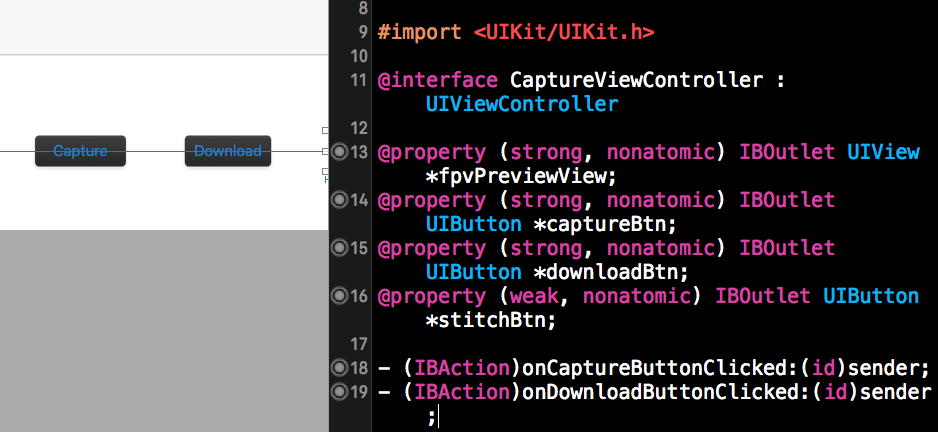

**2.** Add a new variable **selectedPhotoNumber** to record the number of photos selected in the class extension of "CaptureViewController.m" file:

~~~objc
   @property (nonatomic, assign) __block int selectedPhotoNumber;
~~~

Now, let's implement the **DJIPlaybackDelegate** method as shown below to update the selected photo num: 

~~~objc
- (void)playbackManager:(DJIPlaybackManager *)playbackManager didUpdatePlaybackState:(DJICameraPlaybackState *)playbackState
{
    self.selectedPhotoNumber = playbackState.numberOfSelectedFiles;
}
~~~

**3.** Implement the **onDownloadButtonClicked** method as shown below:  

~~~objc
-(IBAction)onDownloadButtonClicked:(id)sender {
    
    weakSelf(target);
    DJICamera *camera = [self fetchCamera];
    [camera setMode:DJICameraModePlayback withCompletion:^(NSError * _Nullable error) {
        weakReturn(target);

        if (error) {
            NSLog(@"Enter playback mode failed: %@", error.description);
        }else {
            [target selectPhotosForPlaybackMode];
        }
    }];
}
~~~

Here we invoke the `setMode:withCompletion:` method to set the camera mode to `DJICameraModePlayback` . If it succeeded, we can invoke the `selectPhotosForPlaybackMode` method to select photos.

**4**. Once it's done, let's implement the `selectPhotosForPlaybackMode` method to select the latest photos you have captured for the panorama:

~~~objc
-(void)selectPhotosForPlaybackMode {
    
    weakSelf(target);
    dispatch_async(dispatch_get_global_queue(DISPATCH_QUEUE_PRIORITY_DEFAULT, 0), ^{
        
        weakReturn(target);
        DJICamera *camera = [target fetchCamera];
        [camera.playbackManager enterMultiplePreviewMode];
        sleep(1);
        [camera.playbackManager enterMultipleEditMode];
        sleep(1);
        
        while (target.selectedPhotoNumber != PHOTO_NUMBER) {
            [camera.playbackManager selectAllFilesInPage];
            sleep(1);
            
            if(target.selectedPhotoNumber > PHOTO_NUMBER){
                for(int unselectFileIndex = 0; target.selectedPhotoNumber != PHOTO_NUMBER; unselectFileIndex++){
                    [camera.playbackManager toggleFileSelectionAtIndex:unselectFileIndex];
                    sleep(1);
                }
                break;
            }
            else if(target.selectedPhotoNumber < PHOTO_NUMBER) {
                [camera.playbackManager goToPreviousMultiplePreviewPage];
                sleep(1);
            }
        }
        [target downloadPhotosForPlaybackMode];
    });
}
~~~

It takes a few seconds for the drone to respond to commands, so you should dispatch an asynchronous thread to send commands and call the `sleep()` between them in case you freeze the UI interaction of in main thread. As shown in the flow diagram above, you should enter **MultiplePreviewMode** and **MultipleEditMode** before selecting photos. But how do we select the lastest 8 photos for panorama? Here is our strategy:

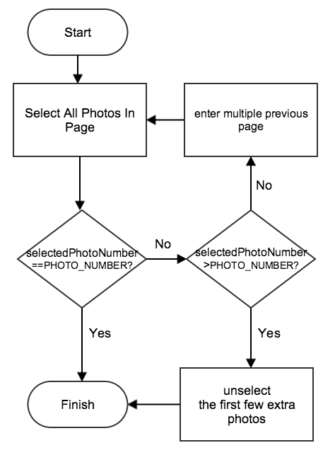

The default selected photo is the last photo. Select all photos in the last page. If you have selected more photos than you need, you can deselect the extra photos starting from the index 0. If you do not have enough photos selected, just go to the previous page and repeat the procedure again until you select the exact number of photos you needed. Here is the gif animation for selecting photos:

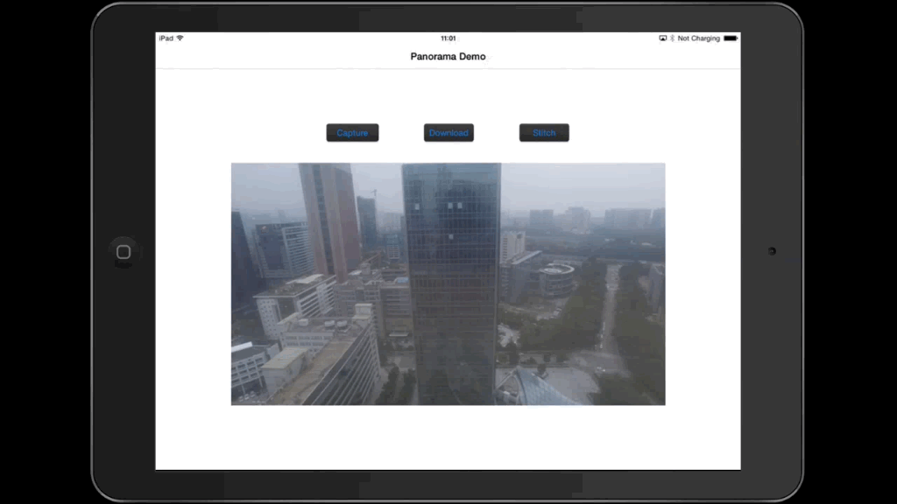

**5.** After you select all the photos, invoke the **downloadPhotosForPlaybackMode** method to download all the photos you need.

Create and implement the `downloadPhotosForPlaybackMode` method as shown below:

~~~objc
-(void)downloadPhotosForPlaybackMode {
    __block int finishedFileCount = 0;
    __block NSMutableData* downloadedFileData;
    __block long totalFileSize;
    __block NSString* targetFileName;
    
    self.imageArray=[NSMutableArray new];
    
    DJICamera *camera = [self fetchCamera];
    if (camera == nil) return;
    
    weakSelf(target);
    [camera.playbackManager downloadSelectedFilesWithPreparation:^(NSString * _Nullable fileName, DJIDownloadFileType fileType, NSUInteger fileSize, BOOL * _Nonnull skip) {
        
        totalFileSize=(long)fileSize;
        downloadedFileData=[NSMutableData new];
        targetFileName=fileName;
        
        dispatch_async(dispatch_get_main_queue(), ^{
            weakReturn(target);
            [target showDownloadProgressAlert];
            [target.downloadProgressAlert setTitle:[NSString stringWithFormat:@"Download (%d/%d)", finishedFileCount + 1, PHOTO_NUMBER]];
            [target.downloadProgressAlert setMessage:[NSString stringWithFormat:@"FileName:%@ FileSize:%0.1fKB Downloaded:0.0KB", fileName, fileSize / 1024.0]];
        });
        
    } process:^(NSData * _Nullable data, NSError * _Nullable error) {
        
        weakReturn(target);
        [downloadedFileData appendData:data];
        
        dispatch_async(dispatch_get_main_queue(), ^{
            [target.downloadProgressAlert setMessage:[NSString stringWithFormat:@"FileName:%@ FileSize:%0.1fKB Downloaded:%0.1fKB", targetFileName, totalFileSize / 1024.0, downloadedFileData.length / 1024.0]];
        });
        
    } fileCompletion:^{
        weakReturn(target);
        finishedFileCount++;
        
        UIImage *downloadPhoto=[UIImage imageWithData:downloadedFileData];
        [target.imageArray addObject:downloadPhoto];
        
    } overallCompletion:^(NSError * _Nullable error) {
        
        dispatch_async(dispatch_get_main_queue(), ^{
            [target.downloadProgressAlert dismissWithClickedButtonIndex:0 animated:YES];
            target.downloadProgressAlert = nil;
            
            if (error) {
                UIAlertView* alertView = [[UIAlertView alloc] initWithTitle:@"Download failed" message:[NSString stringWithFormat:@"%@", error.description] delegate:nil cancelButtonTitle:@"OK" otherButtonTitles:nil];
                [alertView show];
            }else
            {
                UIAlertView* alertView = [[UIAlertView alloc] initWithTitle:[NSString stringWithFormat:@"Download (%d/%d)", finishedFileCount, PHOTO_NUMBER] message:@"download finished" delegate:nil cancelButtonTitle:@"OK" otherButtonTitles:nil];
                [alertView show];
            }
            
            DJICamera *camera = [target fetchCamera];
            [camera setMode:DJICameraModeShootPhoto withCompletion:^(NSError * _Nullable error) {
                if (error) {
                    UIAlertView* alertView = [[UIAlertView alloc] initWithTitle:@"Set CameraMode to ShootPhoto Failed" message:[NSString stringWithFormat:@"%@", error.description] delegate:nil cancelButtonTitle:@"OK" otherButtonTitles:nil];
                    [alertView show];
                    
                }
            }];
            
        });
        
    }];
}

-(void) showDownloadProgressAlert {
    if (self.downloadProgressAlert == nil) {
        self.downloadProgressAlert = [[UIAlertView alloc] initWithTitle:@"" message:@"" delegate:nil cancelButtonTitle:nil otherButtonTitles:nil];
        [self.downloadProgressAlert show];
    }
}
~~~

In the code above, we firstly add several variables and init the **imageArray** object. Then call the DJIPlaybackManager's following method to download the selected photos:

~~~objc
- (void)downloadSelectedFilesWithPreparation:(DJIFileDownloadPreparingBlock)prepareBlock process:(DJIFileDownloadingBlock)dataBlock fileCompletion:(DJIFileDownloadCompletionBlock)fileCompletionBlock overallCompletion:(DJICompletionBlock)overallCompletionBlock;
~~~

In the **DJIFileDownloadPreparingBlock**, we initialize the "downloadedFileData" and dispatch a main thread to show alertView to user for notifying the current download progress. Then we append the "downloadedFileData" in the **DJIFileDownloadingBlock** and update the "downloadProgressAlert" message with the current process in the main thread. 

In the **DJIFileDownloadCompletionBlock**, we increase the "finishedFileCount" property value and save the downloaded photo image in the **imageArray**. in a local album in the **DJIFileDownloadCompletionBlock**. 

Finally, let's notify the users the download result by showing UIAlertView in the main thread in the **overallCompletionBlock**. Moreover, set the camera mode back to "DJICameraModeShootPhoto" after the photodownload finished.

Build and run the code, press the **capture** button to rotate the drone and shoot photos, after it finished, press **download** button to download all the photos shoot. If everything goes well, you should see the following animation:

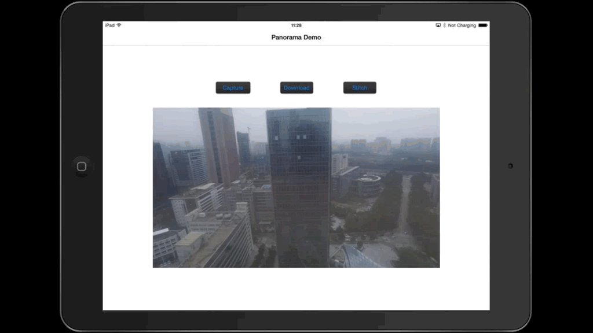

### Using Media Download Mode

In order to download multiple photos using Media Download Mode, you should make good use of the `DJIMediaManager` and `DJIFetchMediaTaskScheduler` to refresh media file list and schedule the tasks.

Firstly, enter **Media Download** mode, then refresh the media file list from the SD card, furthermore resume the `DJIFetchMediaTaskScheduler`, moreover, create multiple `DJIFetchMediaTask` for the photos to download, lastly, enqueue the tasks to the scheduler to execute and download photos.

Now, let's improve the `onDownloadButtonClicked:` method as shown below:

~~~objc
-(IBAction)onDownloadButtonClicked:(id)sender {
    
    weakSelf(target);
    DJICamera *camera = [self fetchCamera];
    if (camera.isPlaybackSupported) {
        [camera setMode:DJICameraModePlayback withCompletion:^(NSError * _Nullable error) {
            weakReturn(target);

            if (error) {
                NSLog(@"Enter playback mode failed: %@", error.description);
            }else {
                [target selectPhotosForPlaybackMode];
            }
        }];
    }
    else if (camera.isMediaDownloadModeSupported) {
        [camera setMode:DJICameraModeMediaDownload withCompletion:^(NSError * _Nullable error) {
            weakReturn(target);
            if (error) {
                NSLog(@"Enter Media Download mode failed: %@", error.description);
            } else {
                [target loadMediaListsForMediaDownloadMode];
            }
        }];
    }
}
~~~ 

Here we firstly check if the DJICamera support media download mode, and invoke the `setMode:withCompletion:` method to set the camera mode to `DJICameraModeMediaDownload`. If it succeeded, we can invoke the `loadMediaListsForMediaDownloadMode` method to select photos. 

Next, let's implement the `loadMediaListsForMediaDownloadMode` method as shown below:

~~~objc
-(void)loadMediaListsForMediaDownloadMode {
    DJICamera *camera = [self fetchCamera];
    [self showDownloadProgressAlert];
    [self.downloadProgressAlert setTitle:[NSString stringWithFormat:@"Refreshing file list. "]];
    [self.downloadProgressAlert setMessage:[NSString stringWithFormat:@"Loading..."]];

    weakSelf(target);
    [camera.mediaManager refreshFileListWithCompletion:^(NSError * _Nullable error) {
        weakReturn(target);
        if (error) {
            [target.downloadProgressAlert dismissWithClickedButtonIndex:0 animated:YES];
            target.downloadProgressAlert = nil;
            NSLog(@"Refresh file list failed: %@", error.description);
        }
        else {
            [target downloadPhotosForMediaDownloadMode];
        }
    }];
}
~~~

In the code above, we invoke the `refreshFileListWithCompletion:` method of `DJIMediaManager` to refresh the file list from the SD card. If there is no error, invoke the `downloadPhotosForMediaDownloadMode` method to download photos.

Once you finish the steps above, let's implement the `downloadPhotosForMediaDownloadMode` method as shown below to download photos:

~~~objc
-(void)downloadPhotosForMediaDownloadMode {
    __block int finishedFileCount = 0;

    self.imageArray=[NSMutableArray new];

    DJICamera *camera = [self fetchCamera];
    NSArray<DJIMediaFile *> *files = [camera.mediaManager fileListSnapshot];
    if (files.count < PHOTO_NUMBER) {
        [self.downloadProgressAlert dismissWithClickedButtonIndex:0 animated:YES];
        self.downloadProgressAlert = nil;
        UIAlertView* alertView = [[UIAlertView alloc] initWithTitle:@"Download failed" message:[NSString stringWithFormat:@"Not enough photos are taken. "] delegate:nil cancelButtonTitle:@"OK" otherButtonTitles:nil];
        [alertView show];
        return;
    }

    [camera.mediaManager.taskScheduler resumeWithCompletion:^(NSError * _Nullable error) {
        if (error) {
            [self.downloadProgressAlert dismissWithClickedButtonIndex:0 animated:YES];
            self.downloadProgressAlert = nil;
            UIAlertView* alertView = [[UIAlertView alloc] initWithTitle:@"Download failed" message:[NSString stringWithFormat:@"Resume file task scheduler failed. "] delegate:nil cancelButtonTitle:@"OK" otherButtonTitles:nil];
            [alertView show];
        }
    }];

    [self.downloadProgressAlert setTitle:[NSString stringWithFormat:@"Downloading..."]];
    [self.downloadProgressAlert setMessage:[NSString stringWithFormat:@"Download (%d/%d)", 0, PHOTO_NUMBER]];

    weakSelf(target);
    for (int i = (int)files.count - PHOTO_NUMBER; i < files.count; i++) {
        DJIMediaFile *file = files[i];
        
        DJIFetchMediaTask *task = [DJIFetchMediaTask taskWithFile:file content:DJIFetchMediaTaskContentPreview andCompletion:^(DJIMediaFile * _Nonnull file, DJIFetchMediaTaskContent content, NSError * _Nullable error) {
            weakReturn(target);
            if (error) {
                [target.downloadProgressAlert dismissWithClickedButtonIndex:0 animated:YES];
                target.downloadProgressAlert = nil;
                UIAlertView* alertView = [[UIAlertView alloc] initWithTitle:@"Download failed" message:[NSString stringWithFormat:@"Download file %@ failed. ", file.fileName] delegate:nil cancelButtonTitle:@"OK" otherButtonTitles:nil];
                [alertView show];
            }
            else {
                [target.imageArray addObject:file.preview];
                finishedFileCount++;
                [target.downloadProgressAlert setMessage:[NSString stringWithFormat:@"Download (%d/%d)", finishedFileCount, PHOTO_NUMBER]];

                if (finishedFileCount == PHOTO_NUMBER) {

                    [target.downloadProgressAlert dismissWithClickedButtonIndex:0 animated:YES];
                    target.downloadProgressAlert = nil;
                    UIAlertView* alertView = [[UIAlertView alloc] initWithTitle:@"Download Complete" message:[NSString stringWithFormat:@"%d files have been downloaded. ", PHOTO_NUMBER] delegate:nil cancelButtonTitle:@"OK" otherButtonTitles:nil];
                    [alertView show];
                    [camera setMode:DJICameraModeShootPhoto withCompletion:^(NSError * _Nullable error) {
                        if (error) {
                            UIAlertView* alertView = [[UIAlertView alloc] initWithTitle:@"Set CameraMode to ShootPhoto Failed" message:[NSString stringWithFormat:@"%@", error.description] delegate:nil cancelButtonTitle:@"OK" otherButtonTitles:nil];
                            [alertView show];
                        }
                    }];
                }
            }
        }];
        [camera.mediaManager.taskScheduler moveTaskToEnd:task];
    }
}
~~~

In the code above, we implement the following features:

1. Firstly, we initialize an NSMutableArray `imageArray`, which will be used to stored the downloaded images. And then invoke the `fileListSnapshot` method of `DJIMediaManager` to get the current `DJIMediaFile` file list, and store them in the `files` array object. After that, we check if the current media files' count is less than `PHOTO_NUMBER`, which is the photo count to create a panorama. If so, inform the user that not enough photos are taken using a UIAlertView and return.

2. Moreover, we invoke the `resumeWithCompletion:` method to resume the `DJIFetchMediaTaskScheduler` and inform the user that resume file task scheduler failed using a UIAlertView. 

3. Lastly, we create a for loop and create 8(The value of `PHOTO_NUMBER`) `DJIFetchMediaTask` objects by invoking the `taskWithFile:content:andCompletion:` method of `DJIFetchMediaTask` class. Inside the completion block of the method, we firstly check if any error exists and show a UIAlertView to inform users. If not, access the `preview` property of `DJIMediaFile` to get the preview image for this media and add it to the `imageArray` array. Next, increase the value of `finishedFileCount` by 1 and show the media file download status message by using the `downloadProgressAlert`. If the value of `finishedFileCount` reach 8, we show a UIAlertView to inform the user that the download complete and set the camera mode back to `DJICameraModeShootPhoto`. Lastly, we invoke the `moveTaskToEnd:` method of `DJIFetchMediaTaskScheduler` to push the newly created task to the back of the queue for executing.

Build and run the code, press the **capture** button to rotate the drone and shoot photos, here we use **Spark** for testing. After it finished, press **download** button to download all the photos shoot. If everything goes well, you should see the following animation:

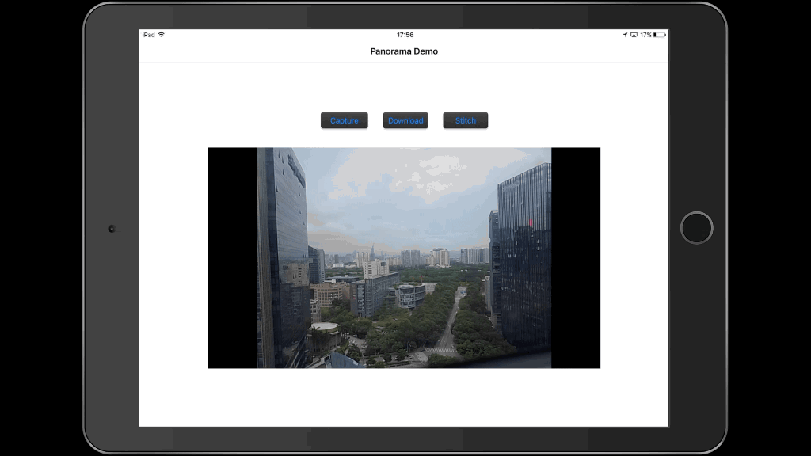

## Using OpenCV to Create Panorama

### Creating Stitching View

Since we don't need the FPV view when stitching photos, we can create a new view controller called **StitchingViewController** to generate and present the panorama photo.

**1.** Embed the **CaptureViewController** in a navigation controller and add a new button called **Stitch** on it.

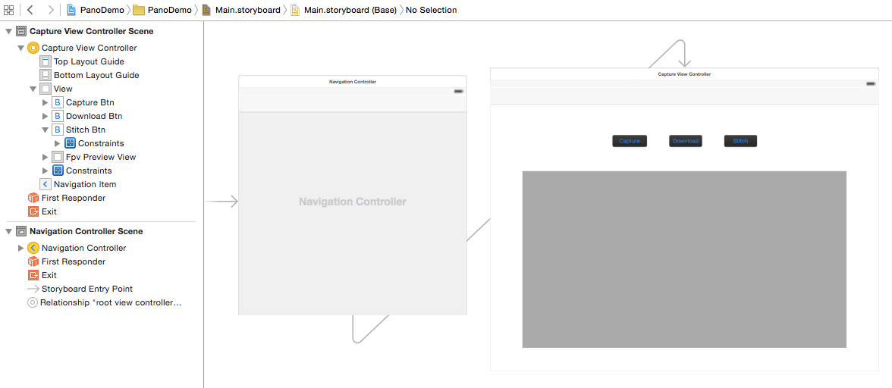

Then create a new view controller called **StitchingViewController** and add it in the **Main.storyboard** correspondingly. Then add a button named **Stitch** in the **CaptureViewController** and set its action segue to show the **StitchingViewController**. Set the segue's identifier to **Stitching**.

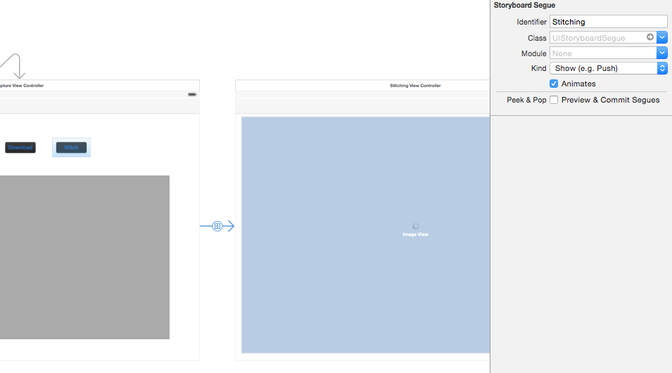

**2.** Let's add an instance variable **imageArray** in the **StitchingViewController.h**:

~~~objc
@property (strong,nonatomic) NSMutableArray * imageArray;
~~~

Then add the **prepareForSegue** method to pass the downloaded photos to the next view controller in **CaptureViewController.m**:

~~~objc
//Pass the downloaded photos to StitchingViewController
-(void)prepareForSegue:(UIStoryboardSegue *)segue sender:(id)sender {
    if([segue.identifier isEqualToString:@"Stitching"]) {
        [segue.destinationViewController setValue:self.imageArray forKey:@"imageArray"];
    }
}
~~~

**3.** Add an activity indicator in the **StitchingViewController** in Main.storyboard, set its behavior to **Hides When Stopped**, then set its outlet as **activityIndicator** in the StitchingViewController.h file:

### Importing OpenCV

**1.** Build the **opencv2.framework** for iOS. You can check for more details in <a href="http://docs.opencv.org/doc/tutorials/introduction/ios_install/ios_install.html" target="_blank">Installation OpenCV in iOS</a>. If you have any difficulties compiling the source code, you can just download this project and copy the **opencv2.framework**. 

**2.** Select the project target, go to **Build Phases** -> **Link Binary With Libraries**. Click the "+" button at the bottom and add  the**AssetsLibrary.framework** library to your project. Click the "+" button, click on **Add others** and navigate to the directory where **opencv2.framework** is located and click open.

**3.** Add a PCH file into your project. Go to **Build Setting** -> **Precompile Prefix Header**, set its value **YES**, and set **Prefix Header** to be the location of the PCH file.

Open your PCH file and add the following lines of code:

~~~objc
#ifdef __cplusplus
    #import <opencv2/opencv.hpp>
#endif

#ifdef __OBJC__
    #import <UIKit/UIKit.h>
    #import <Foundation/Foundation.h>
#endif
~~~

**4.** Build your project. If nothing wrong happens, you may successfully setup the OpenCV library in your Xcode project.

### Stitching Photos

**1.** In the OpenCV, all the image processing operations are usually carried out on the Mat structure. However, on iOS, to render an image on screen it has to be an instance of the UIImage class. In order to convert an OpenCV Mat to an UIImage we can use the Core Graphics framework in iOS. Find more details, please check <a href="http://docs.opencv.org/doc/tutorials/ios/image_manipulation/image_manipulation.html#opencviosimagemanipulation" target="_blank">Convert UIImage to cv::Mat</a>. You can define a **OpenCVConversion** class to deal with the conversion issue.

Let's implement the **OpenCVConversion.h** file shown as below:

~~~objc
@interface OpenCVConversion : NSObject

+ (cv::Mat)cvMatFromUIImage:(UIImage *)image;//convert UIImage to cv::Mat
+ (cv::Mat)cvMatGrayFromUIImage:(UIImage *)image;//convert UIImage to gray cv::Mat
+ (cv::Mat)cvMat3FromUIImage:(UIImage *)image; //convert UIImage to cv::Mat without alpha channel
+(UIImage *)UIImageFromCVMat:(cv::Mat)cvMat;//convert cv::Mat to UIImage

@end
~~~

Next, implement the **OpenCVConversion.mm** file:

~~~objc
#import "OpenCVConversion.h"

@implementation OpenCVConversion

+ (cv::Mat)cvMatFromUIImage:(UIImage *)image {
    CGColorSpaceRef colorSpace = CGImageGetColorSpace(image.CGImage);
    CGFloat cols = image.size.width;
    CGFloat rows = image.size.height;
    
    cv::Mat cvMat(rows, cols, CV_8UC4); // 8 bits per component, 4 channels (color channels + alpha)
    
    CGContextRef contextRef = CGBitmapContextCreate(cvMat.data,                 // Pointer to  data
                                                    cols,                       // Width of bitmap
                                                    rows,                       // Height of bitmap
                                                    8,                          // Bits per component
                                                    cvMat.step[0],              // Bytes per row
                                                    colorSpace,                 // Colorspace
                                                    kCGImageAlphaNoneSkipLast |
                                                    kCGBitmapByteOrderDefault); // Bitmap info flags
    
    CGContextDrawImage(contextRef, CGRectMake(0, 0, cols, rows), image.CGImage);
    CGContextRelease(contextRef);
    
    return cvMat;
}

+ (cv::Mat)cvMatGrayFromUIImage:(UIImage *)image {
    CGColorSpaceRef colorSpace = CGImageGetColorSpace(image.CGImage);
    CGFloat cols = image.size.width;
    CGFloat rows = image.size.height;
    
    cv::Mat cvMat(rows, cols, CV_8UC1); // 8 bits per component, 1 channels
    
    CGContextRef contextRef = CGBitmapContextCreate(cvMat.data,                 // Pointer to data
                                                    cols,                       // Width of bitmap
                                                    rows,                       // Height of bitmap
                                                    8,                          // Bits per component
                                                    cvMat.step[0],              // Bytes per row
                                                    colorSpace,                 // Colorspace
                                                    kCGImageAlphaNoneSkipLast |
                                                    kCGBitmapByteOrderDefault); // Bitmap info flags
    
    CGContextDrawImage(contextRef, CGRectMake(0, 0, cols, rows), image.CGImage);
    CGContextRelease(contextRef);
    
    return cvMat;
}

+ (cv::Mat)cvMat3FromUIImage:(UIImage *)image {
    cv::Mat result=[self cvMatFromUIImage:image];
    cv::cvtColor(result, result, CV_RGBA2RGB);
    return result;
}

+(UIImage *)UIImageFromCVMat:(cv::Mat)cvMat
{
    NSData *data = [NSData dataWithBytes:cvMat.data length:cvMat.elemSize()*cvMat.total()];
    CGColorSpaceRef colorSpace;
    
    if (cvMat.elemSize() == 1) {
        colorSpace = CGColorSpaceCreateDeviceGray();
    } else {
        colorSpace = CGColorSpaceCreateDeviceRGB();
    }
    
    CGDataProviderRef provider = CGDataProviderCreateWithCFData((__bridge CFDataRef)data);
    
    // Creating CGImage from cv::Mat
    CGImageRef imageRef = CGImageCreate(cvMat.cols,                                 //width
                                        cvMat.rows,                                 //height
                                        8,                                          //bits per component
                                        8 * cvMat.elemSize(),                       //bits per pixel
                                        cvMat.step[0],                            //bytesPerRow
                                        colorSpace,                                 //colorspace
                                        kCGImageAlphaNone|kCGBitmapByteOrderDefault,// bitmap info
                                        provider,                                   //CGDataProviderRef
                                        NULL,                                       //decode
                                        false,                                      //should interpolate
                                        kCGRenderingIntentDefault                   //intent
                                        );
    
    
    // Getting UIImage from CGImage
    UIImage *finalImage = [UIImage imageWithCGImage:imageRef];
    CGImageRelease(imageRef);
    CGDataProviderRelease(provider);
    CGColorSpaceRelease(colorSpace);
    
    return finalImage;
}

@end
~~~

**2.** In order to call OpenCV functions in objective-C, you should create a header file and a C++ file as the stitching wrapper file. Input a vector of cv::Mat and the reference of cv::Mat. This function will tell whether the stitching is successful and return the stitched cv::Mat through a **result** reference. The code in **StitchingWrapper.h** is shown below.

~~~cpp
#ifndef Stitching_Header_h
#define Stitching_Header_h

bool stitch (const cv::vector <cv::Mat> & images, cv::Mat &result);

#endif
~~~

Then implement the **StitchingWrapper.cpp** file with the following code:

~~~cpp
#include "stitchingWrapper.h"
#include "opencv2/highgui/highgui.hpp"
#include "opencv2/stitching/stitcher.hpp"

using namespace cv;

bool stitch (const cv::vector <cv::Mat> & images, cv::Mat &result) {
    Stitcher stitcher = Stitcher::createDefault(false);
    Stitcher::Status status = stitcher.stitch(images, result);
    
    if (status != Stitcher::OK) {
        return false;
    }
    return true;
}
~~~

**3.** Now you can customize your stitching method in the new class called **Stitching**. Here is the class method declaration for stitching implemented in the **Stitching.h** file. Users can input an image array and a reference of cv::Mat, it will return the stitching result:

~~~objc
#import <Foundation/Foundation.h>

@interface Stitching : NSObject
+ (bool) stitchImageWithArray:(NSMutableArray*)imageArray andResult:(cv::Mat &) result;
@end
~~~

Here is the code for **Stitching.mm** file: 

~~~objc
#import "Stitching.h"
#import "StitchingWrapper.h"
#import "OpenCVConversion.h"

#define HIGHT_COMPRESS_RATIO 0.2
#define LOW_COMPRESS_RATIO 1.0

@implementation Stitching

+ (bool) stitchImageWithArray:(NSMutableArray*)imageArray andResult:(cv::Mat &) result {
    if (imageArray == nil || imageArray.count == 0) {
        return false;
    }

    float ratio = HIGHT_COMPRESS_RATIO;
    UIImage *image = [imageArray firstObject];
    if (image.size.height < 1000) {
        ratio = LOW_COMPRESS_RATIO;
    }

    NSMutableArray* compressedImageArray =[NSMutableArray new];
    for(UIImage *rawImage in imageArray){
        UIImage *compressedImage=[self compressedToRatio:rawImage ratio:ratio];
        [compressedImageArray addObject:compressedImage];
    }
    [imageArray removeAllObjects];
    
    
    if ([compressedImageArray count]==0) {
        NSLog (@"imageArray is empty");
        return false;
    }
    cv::vector<cv::Mat> matArray;
    
    for (id image in compressedImageArray) {
        if ([image isKindOfClass: [UIImage class]]) {
            cv::Mat matImage = [OpenCVConversion cvMat3FromUIImage:image];
            matArray.push_back(matImage);
        }
    }
    NSLog(@"Stitching...");
    if(!stitch(matArray, result)){
        return false;
    }
    
    return true;
}

//compress the photo width and height to COMPRESS_RATIO
+ (UIImage *)compressedToRatio:(UIImage *)img ratio:(float)ratio {
    CGSize compressedSize;
    compressedSize.width=img.size.width*ratio;
    compressedSize.height=img.size.height*ratio;
    UIGraphicsBeginImageContext(compressedSize);
    [img drawInRect:CGRectMake(0, 0, compressedSize.width, compressedSize.height)];
    UIImage* compressedImage = UIGraphicsGetImageFromCurrentImageContext();
    UIGraphicsEndImageContext();
    return compressedImage;
}

@end
~~~

Because of the limited computing ability and memory storage of mobile devices, we don't suggest you to process full resolution images, because the stitching process may take a long time or cause run out of memory problem. We call the `+ (UIImage *)compressedToRatio:(UIImage *)img ratio:(float)ratio` method to reduce the photo width and height by a ratio of **HIGHT_COMPRESS_RATIO** or **LOW_COMPRESS_RATIO**, which reduces the resolution dramatically(Like HIGHT_COMPRESS_RATIO2). If the `image` size is not small(The height is less than 1000), we use `LOW_COMPRESS_RATIO`, otherwise, use `HIGHT_COMPRESS_RATIO`.

Then we convert the images to cv::Mat and push them into cv::vector. Finally, we can call the **stitch** function in the **StitchingWrapper.cpp** file to do the actual stitching work.

**4.** Now add an **UIImageView** in the **Main.storyboard**, set its **Mode** to **Aspect Fit** and create its outlet, called **imageView** in the "StitchingViewController.h" file.

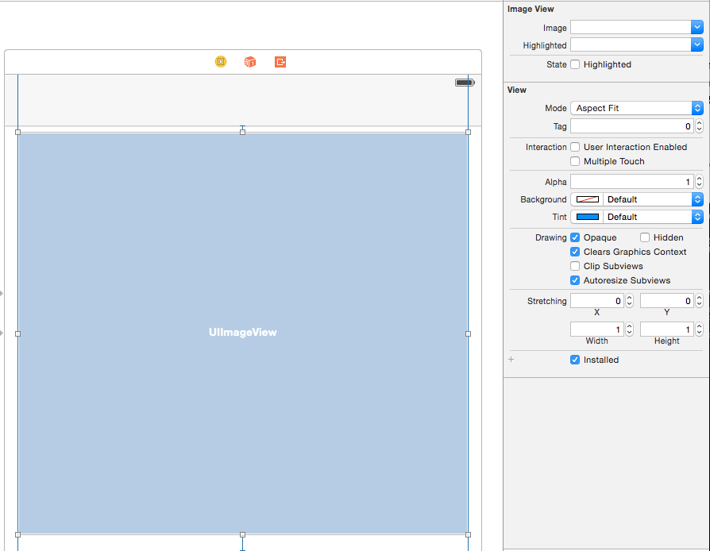

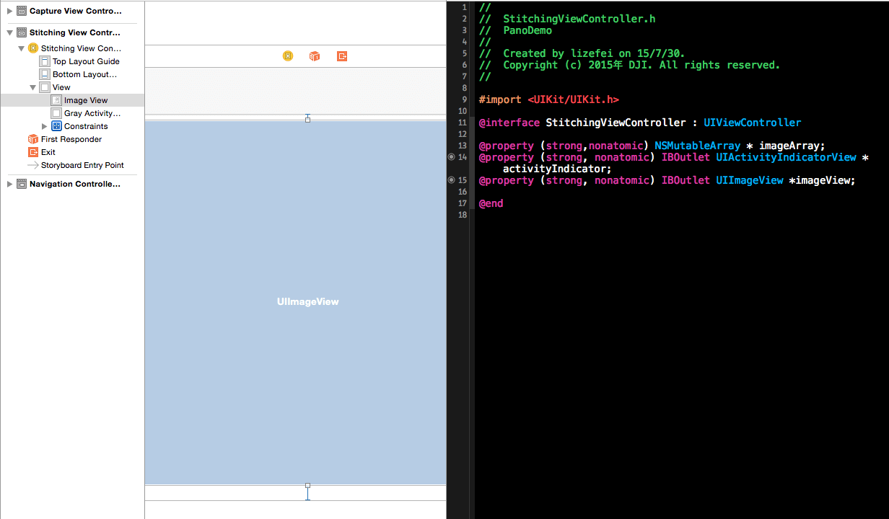

Replace the **StitchingViewController.mm** with the following code:

~~~objc
#import "StitchingViewController.h"
#import "Stitching.h"
#import "OpenCVConversion.h"

@implementation StitchingViewController

- (void)viewDidLoad {
    [super viewDidLoad];
    
    __weak StitchingViewController *weakSelf = self;
    
    dispatch_async(dispatch_get_global_queue(DISPATCH_QUEUE_PRIORITY_DEFAULT, 0), ^{
        cv::Mat stitchMat;
        if(![Stitching stitchImageWithArray:_imageArray andResult:stitchMat]) {
            [weakSelf showAlertWithTitle:@"Stitching" andMessage:@"Stitching failed"];
            return;
        }
        
        cv::Mat cropedMat;
        if(![Cropping cropWithMat:stitchMat andResult:cropedMat]){
            [weakSelf showAlertWithTitle:@"Cropping" andMessage:@"cropping failed"];
            return;
        }
        
        UIImage *stitchImage=[OpenCVConversion UIImageFromCVMat:cropedMat];
        UIImageWriteToSavedPhotosAlbum(stitchImage, nil, nil, nil);
        
        dispatch_async(dispatch_get_main_queue(), ^{
            
            [weakSelf showAlertWithTitle:@"Save Photo Success" andMessage:@"Panoroma photo is saved to Album, please check it!"];
            _imageView.image=stitchImage;
        });
    });

}

//show the alert view in main thread
-(void) showAlertWithTitle:(NSString *)title andMessage:(NSString *)message {
    dispatch_async(dispatch_get_main_queue(), ^{
        UIAlertView* alertView = [[UIAlertView alloc] initWithTitle:title message:message delegate:nil cancelButtonTitle:@"OK" otherButtonTitles:nil];
        [alertView show];
        [_activityIndicator stopAnimating];
    });
}
~~~

Now download the latest photos and click the **Stitch** button. After a minute you should be able to see an amazing panorama photo!

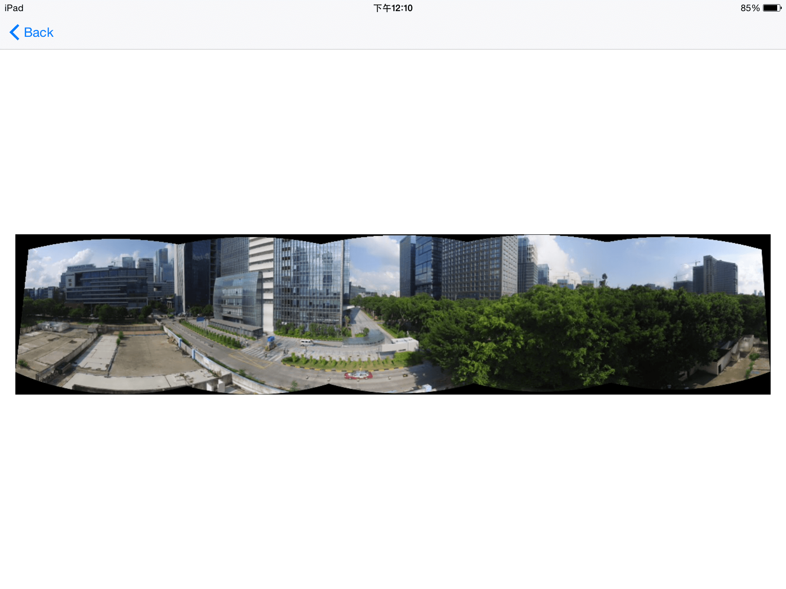

### Cropping the Panorama

So far, you have made an excellent panorama, but the uneven black edges are pretty annoying. Let's improve our code and make your panorama perfect!

**1.** Let's create a new class called **Cropping** to deal with the black edges problem.

Replace the code in **Cropping.h** file with the followings:

~~~objc
#import <Foundation/Foundation.h>

@interface Cropping : NSObject
+ (bool) cropWithMat: (const cv::Mat &)src andResult:(cv::Mat &)dest;
@end
~~~

Then implementation the `+ (bool) cropWithMat: (const cv::Mat &)src andResult:(cv::Mat *)dest` method in the **Cropping.mm** file like this:

~~~objc
#import "Cropping.h"

#define CUTBLACKTHREASHOLD 0.05

@implementation Cropping

+ (bool) cropWithMat: (const cv::Mat &)src andResult: (cv::Mat &)dest {
    cv::Mat gray;
    cvtColor(src, gray, CV_BGR2GRAY);//convert src to gray
    
    cv::Rect roiRect(0,0,gray.cols,gray.rows); // start as the source image - ROI is the complete SRC-Image
    
    while (1) {
        NSLog(@"%d %d %d %d",roiRect.x,roiRect.y,roiRect.width,roiRect.height);
        
        bool isTopNotBlack=checkBlackRow(gray, roiRect.y,roiRect);
        bool isLeftNotBlack=checkBlackColumn(gray, roiRect.x,roiRect);
        bool isBottomNotBlack=checkBlackRow(gray, roiRect.y+roiRect.height,roiRect);
        bool isRightNotBlack=checkBlackColumn(gray, roiRect.x+roiRect.width,roiRect);
        
        if(isTopNotBlack && isLeftNotBlack && isBottomNotBlack && isRightNotBlack) {
            cv::Mat imageReference = src(roiRect);
            imageReference.copyTo(dest);
            return true;
        }
        // If not, scale ROI down
        // if x is increased, width has to be decreased to compensate
        if(!isLeftNotBlack) {
            roiRect.x++;
            roiRect.width--;
        }
        // same is valid for y
        if(!isTopNotBlack) {
            roiRect.y++;
            roiRect.height--;
        }
        if(!isRightNotBlack) {
            roiRect.width--;
        }
        if(!isBottomNotBlack) {
            roiRect.height--;
        }
        if(roiRect.width <= 0 || roiRect.height <= 0) {
            return false;
        }
    }
}

bool checkBlackRow(const cv::Mat& roi, int y, const cv::Rect &rect) {
    int zeroCount = 0;
    for(int x=rect.x; x<rect.width; x++) {
        if(roi.at<uchar>(y, x) == 0) {
            zeroCount++;
        }
    }
    if((zeroCount/(float)roi.cols)>CUTBLACKTHREASHOLD) {
        return false;
    }
    return true;
}

bool checkBlackColumn(const cv::Mat& roi, int x,const cv::Rect &rect) {
    int zeroCount = 0;
    for(int y=rect.y; y<rect.height; y++) {
        if(roi.at<uchar>(y, x) == 0) {
            zeroCount++;
        }
    }
    if((zeroCount/(float)roi.rows)>CUTBLACKTHREASHOLD) {
        return false;
    }
    return true;
}

@end
~~~

The `bool checkBlackRow(const cv::Mat& roi, int y)` function checks whether the number of black pixels in row y is more than **CUTBLACKTHREASHOLD**, while the `bool checkBlackColumn(const cv::Mat& roi, int x)` method checks the same for column x. These two functions indicate whether the row or column is part of a black edge that we don't need. 

`+ (bool) cropWithMat: (const cv::Mat &)src andResult: (cv::Mat &)dest` converts the src cv::Mat to gray cv::Mat and initializes the **roiRect** to be the frame of **src** cv::Mat. Then it checks each of the four edges of the **src** Mat in **roiRect**. If an edge is black, it narrows the corresponding edge of **roiRect** and repeats checking and narrowing until none of the edges are black. Finally, it will copy the pixels in the **roiRect** of **src** to **dest** to complete the cropping process shown below.

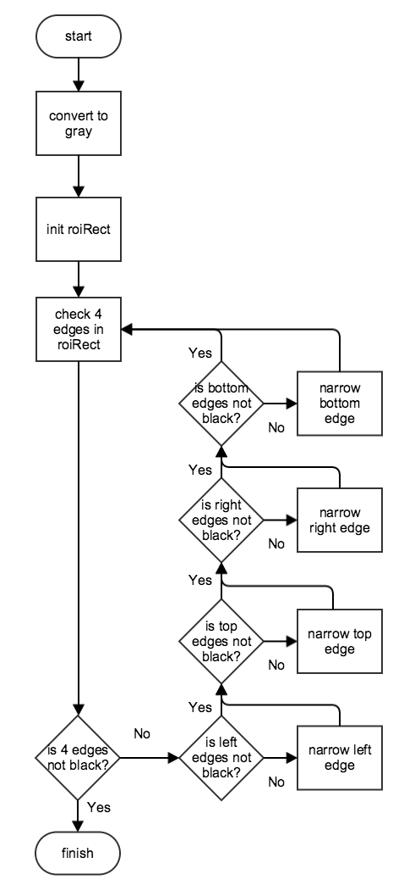

**2.** Rewrite the **Stitching.mm** file as shown below: 

~~~objc
#import "StitchingViewController.h"
#import "Stitching.h"
#import "OpenCVConversion.h"
#import "Cropping.h"

@implementation StitchingViewController

- (void)viewDidLoad {
    [super viewDidLoad];
    
    __weak StitchingViewController *weakSelf = self;
    dispatch_async(dispatch_get_global_queue(DISPATCH_QUEUE_PRIORITY_DEFAULT, 0), ^{
        cv::Mat stitchMat;
        if(![Stitching stitchImageWithArray:_imageArray andResult:stitchMat]) {
            [weakSelf showAlertWithTitle:@"Stitching" andMessage:@"Stitching failed"];
            return;
        }
        
        cv::Mat cropedMat;
        if(![Cropping cropWithMat:stitchMat andResult:cropedMat]){
            [weakSelf showAlertWithTitle:@"Cropping" andMessage:@"cropping failed"];
            return;
        }
        
        UIImage *stitchImage=[OpenCVConversion UIImageFromCVMat:cropedMat];
        UIImageWriteToSavedPhotosAlbum(stitchImage, nil, nil, nil);
        
        dispatch_async(dispatch_get_main_queue(), ^{
            
            [weakSelf showAlertWithTitle:@"Save Photo Success" andMessage:@"Panoroma photo is saved to Album, please check it!"];
            _imageView.image=stitchImage;
        });
    });

}

//show the alert view in main thread
-(void) showAlertWithTitle:(NSString *)title andMessage:(NSString *)message {
    dispatch_async(dispatch_get_main_queue(), ^{
        UIAlertView* alertView = [[UIAlertView alloc] initWithTitle:title message:message delegate:nil cancelButtonTitle:@"OK" otherButtonTitles:nil];
        [alertView show];
        [_activityIndicator stopAnimating];
    });
}

@end
~~~

Build and run the app, shoot a series of photos, download them and stitch them together. You should generat a perfect panorama now! Here is an example:

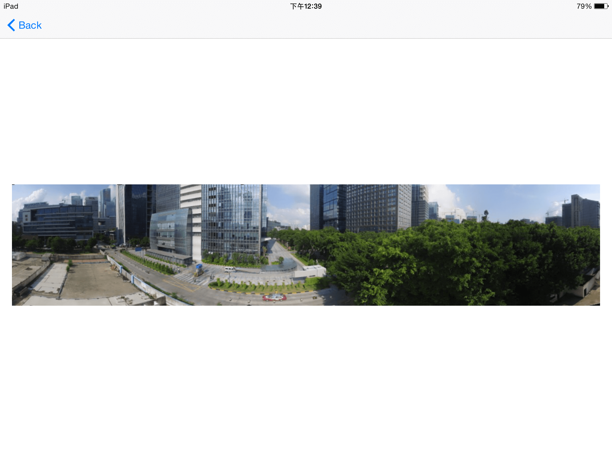

### Summary
   
   In this tutorial, you’ve learned how to use the Virtual Stick feature and the WaypointMission feature of Intelligent Navigation to control the aircraft to rotate and take photos. Also, you learn how to rotate the gimbal to take panorama photos too. Lastly, we used the OpenCV's features to stitch and crop photos into a cool panorama!
      
   Congratulations! Now that you've finished the demo project, you can use what you have learnt to start building your own panorama applications. You can improve the project by showing the aircraft's flight mode type, current GPS satellite count, vertical and horizontal flight speed and the flight altitude, etc. In order to make an amazing Panorama Application, you still have a long way to go! Good luck, and hope you enjoyed this tutorial!

