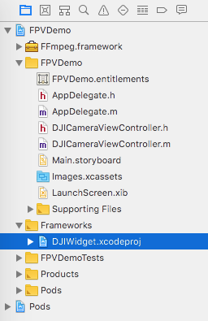
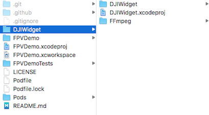
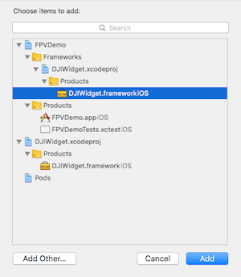
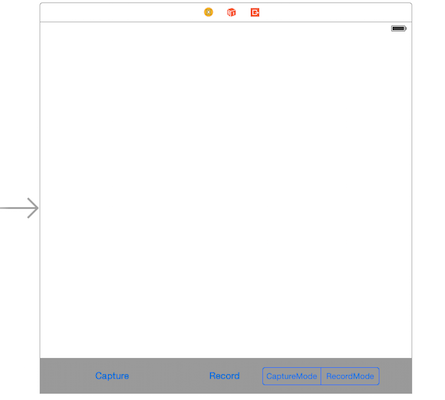
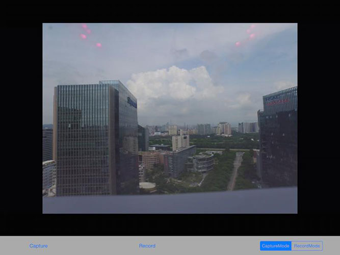
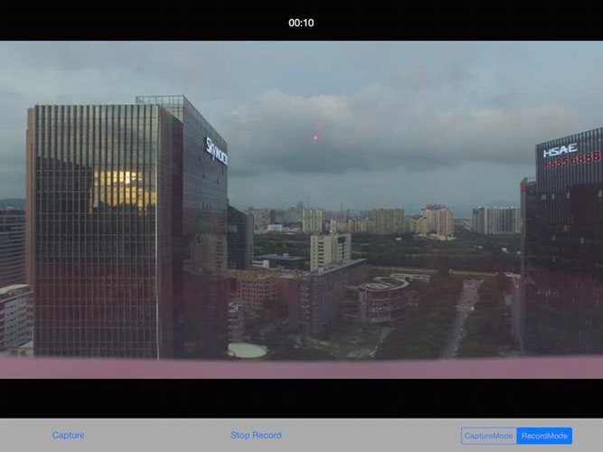

*If you come across any mistakes or bugs in this tutorial, please let us know using a Github issue, a post on the DJI forum. Please feel free to send us Github pull request and help us fix any issues.*

---

This tutorial is designed for you to gain a basic understanding of the DJI Mobile SDK. It will implement the FPV view and two basic camera functionalities: **Take Photo** and **Record video**.

You can download the tutorial's final sample code project from this [Github Page](https://github.com/DJI-Mobile-SDK-Tutorials/iOS-FPVDemo).
   
We use Phantom 4 as an example to make this demo.
   
## Downloading the SDK

You can download the latest iOS SDK from here: <a href="https://developer.dji.com/mobile-sdk/downloads/" target="_blank">https://developer.dji.com/mobile-sdk/downloads/</a>.

Minimum Requirement: iOS 8.0 or above.

## Importing and Activating the SDK

Now, let's create a new project in Xcode, choose **Single View Application** template for your project and press "Next", then enter "FPVDemo" in the **Product Name** field and keep the other default settings.

Once the project is created, let's delete the "ViewController.h" and "ViewController.m" files created by Xcode by default. Create a new ViewController named "DJICameraViewController". 

Now, let's import the **DJISDK.framework** to it and implement the SDK activation process in the "DJICameraViewController.m" file. If you are not familiar with the process of importing and activating DJI SDK, please check the Github source code and this tutorial: [Importing and Activating DJI SDK in Xcode Project](../application-development-workflow/workflow-integrate.html#Xcode-Project-Integration) for details.

## Implementing the First Person View

### Importing the VideoPreviewer

 **1**. We use the **FFMPEG** decoding library (found at <a href="http://ffmpeg.org" target="_blank">http://ffmpeg.org</a>) to do software video decoding here. For the hardware video decoding, we provide a **DJIH264Decoder** decoding library. You can find them in the **VideoPreviewer** folder, which you can download it from <a href="https://github.com/dji-sdk/Mobile-SDK-iOS/tree/master/Sample%20Code/VideoPreviewer" target="_blank">DJI iOS SDK Github Repository</a>. Download and copy the entire **VideoPreviewer** folder to your Xcode project's "Frameworks" folder and then add the "VideoPreviewer.xcodeproj" to the "Frameworks" folder in Xcode project navigator, as shown below:
  
 
 
> Note: Please Make sure the **VideoPreviewer** folder and **DJISDK.framework** are in the same **Frameworks** folder like this:
> 
> 
 
 **2**. Next, let's select the "FPVDemo" target and open the "General" tab. In the "Embedded Binaries" section, press "+" button to add the "VideoPreviewer.framework" as shown below:
 
  
  
  
### Working on the DJICameraViewController
   
 **1**. Open Main.storyboard, add a new View Controller and set **DJICameraViewController** as the **Class** for it:
  
  
  
Add a UIView inside the View Controller. Then, add two UIButtons and one UISegmentedControl at the bottom of the View Controller as shown below:
  
  
  
  Go to DJICameraViewController.m file and import the **DJISDK** and **VideoPreviewer** header files. Next implement two delegate protocols and set the IBOutlets and IBActions for the UI we just create in Main.storyboard as shown below:
  
~~~objc
#import <DJISDK/DJISDK.h>
#import <VideoPreviewer/VideoPreviewer.h>

@interface DJICameraViewController ()<DJICameraDelegate, DJISDKManagerDelegate, DJIBaseProductDelegate>

@property (weak, nonatomic) IBOutlet UIButton *recordBtn;
@property (weak, nonatomic) IBOutlet UISegmentedControl *changeWorkModeSegmentControl;
@property (weak, nonatomic) IBOutlet UIView *fpvPreviewView;

- (IBAction)captureAction:(id)sender;
- (IBAction)recordAction:(id)sender;
- (IBAction)changeWorkModeAction:(id)sender;
~~~

 **2**. In the `viewDidAppear` method, set the `fpvPreviewView` instance variable as the view of **VideoPreviewer** to show the Video Stream and reset it to nil in the `viewWillDisappear` method:
 
~~~objc
- (void)viewDidAppear:(BOOL)animated
{
    [super viewDidAppear:animated];
    [[VideoPreviewer instance] setView:self.fpvPreviewView];
    [self registerApp];
}

- (void)viewWillDisappear:(BOOL)animated
{
    [super viewWillDisappear:animated];
    [[VideoPreviewer instance] setView:nil];   
}
~~~

 **3**. Moreover, implement the "DJISDKManagerDelegate" and "DJIBaseProductDelegate" delegate methods to fetch DJICamera object and set its delegate to "self" as shown below:
  
~~~objc

- (DJICamera*) fetchCamera {

    if (![DJISDKManager product]) {
        return nil;
    }
    
    if ([[DJISDKManager product] isKindOfClass:[DJIAircraft class]]) {
        return ((DJIAircraft*)[DJISDKManager product]).camera;
    }else if ([[DJISDKManager product] isKindOfClass:[DJIHandheld class]]){
        return ((DJIHandheld *)[DJISDKManager product]).camera;
    }

    return nil;
}

#pragma mark DJISDKManagerDelegate Method

-(void) sdkManagerProductDidChangeFrom:(DJIBaseProduct* _Nullable) oldProduct to:(DJIBaseProduct* _Nullable) newProduct
{
    if (newProduct) {
        [newProduct setDelegate:self];
        DJICamera* camera = [self fetchCamera];
        if (camera != nil) {
            camera.delegate = self;
        }
    }
}

#pragma mark - DJIBaseProductDelegate Method

-(void) componentWithKey:(NSString *)key changedFrom:(DJIBaseComponent *)oldComponent to:(DJIBaseComponent *)newComponent {
    
    if ([key isEqualToString:DJICameraComponent] && newComponent != nil) {
        __weak DJICamera* camera = [self fetchCamera];
        if (camera) {
            [camera setDelegate:self];
        }
    }
}
  
~~~
  
  Firstly, we create the `- (DJICamera*) fetchCamera` method to fetch the updated DJICamera object. Before we get return the DJICamera object, we need to check if the product object of DJISDKManager is kind of **DJIAircraft** of **DJIHandheld** class. Since the camera component of the aircraft or handheld device may be changed or disconnected, we need to fetch the camera object everytime we want to use it to ensure we get the correct camera object. 
  
  Next, we invoke the `sdkManagerProductDidChangeFrom:to:` delegate method to get the `newProduct` and set the DJIICamera object's delegate here. This delegate method will invoke when the product connection status changes.
  
  Moverover, let's invoke the `componentWithKey:changedFrom:to:` delegate method to fetch the camera object and set its delegate too. Since the camera component of the aircraft may change to another type, we should invoke this delegate method to check the component changes too.

**4**. Furthermore, invoke the `start` method of **VideoPreviewer** instance in the following DJISDKManagerDelegate method to start the video decoding when register app successfully:
 
~~~objc 
- (void)sdkManagerDidRegisterAppWithError:(NSError *)error
{
    NSString* message = @"Register App Successed!";
    if (error) {
        message = @"Register App Failed! Please enter your App Key and check the network.";
    }else
    {
        NSLog(@"registerAppSuccess");
    
        [DJISDKManager startConnectionToProduct];
        [[VideoPreviewer instance] start];
    }
    
    [self showAlertViewWithTitle:@"Register App" withMessage:message];
}
~~~
        
 **5**. Lastly, let's implement the "DJICameraDelegate" method, as shown below:
  
~~~objc

#pragma mark - DJICameraDelegate Method

-(void)camera:(DJICamera *)camera didReceiveVideoData:(uint8_t *)videoBuffer length:(size_t)size
{
    [[VideoPreviewer instance] push:videoBuffer length:(int)size];
}

-(void) camera:(DJICamera*)camera didUpdateSystemState:(DJICameraSystemState*)systemState
{
}

~~~

 Here, we use the `-(void)camera:(DJICamera *)camera didReceiveVideoData:(uint8_t *)videoBuffer length:(size_t)size` method to get the live H264 video feed data and send them to the **VideoPreviewer** to decode.
   
  Moreover, the `-(void) camera:(DJICamera*)camera didUpdateSystemState:(DJICameraSystemState*)systemState` method is used to get the camera state from the camera on your aircraft. It will be invoked frequently, so you can update your user interface or camera settings accordingly here.

## Connecting to the Aircraft or Handheld Device

After you finish the steps above, you can now connect your mobile device to your DJI Aircraft to use the application, like checking the FPV View. Here are the guidelines:

* In order to connect to a DJI Phantom 4, Inspire 1, Phantom 3 Professional, etc:

  **1**. First, turn on your remote controller.
  
  **2**. Then, turn on the power of the DJI aircraft.
  
  **3**. Connect your iOS device to the remote controller using the lightning cable.
  
  **4**. Run the application and wait for a few seconds, you will be able to view the live video stream from your aircraft's camera based on what we've finished of the application so far!
  
* In order to connect to Phantom 3 Standard, Phantom 3 4K, or OSMO:

  **1**. First, turn on your remote controller or OSMO.
   
  **2**. Then, turn on the power of the DJI aircraft. (If you are using Phantom 3 Standard or Phantom 3 4K)
  
  **3**. Search for the WiFi of the aircraft's remote controller or OSMO and connect your iOS device to it.
  
  **4**. Run the application and wait for a few seconds, you will be able to view the live video stream from your aircraft or OSMO's camera based on what we've finished of the application so far!
  
## Enjoying the First Person View

If you can see the live video stream in the application, congratulations! Let's move forward.

  

## Implementing the Capture function

Let's implement the `captureAction` IBAction method as shown below:

~~~objc
- (IBAction)captureAction:(id)sender {
    
    __weak DJICamera* camera = [self fetchCamera];
    if (camera) {
        WeakRef(target);
        [camera setShootPhotoMode:DJICameraShootPhotoModeSingle withCompletion:^(NSError * _Nullable error) {
            dispatch_after(dispatch_time(DISPATCH_TIME_NOW, (int64_t)(1 * NSEC_PER_SEC)), dispatch_get_main_queue(), ^{
                [camera startShootPhotoWithCompletion:^(NSError * _Nullable error) {
                    WeakReturn(target);
                    if (error) {
                        [target showAlertViewWithTitle:@"Take Photo Error" withMessage:error.description];
                    }
                }];
            });
        }];
    }
}
~~~

In the code above, we firstly invoke the following method of DJICamera to set the shoot photo mode to `DJICameraShootPhotoModeSingle`:

~~~
- (void)setShootPhotoMode:(DJICameraShootPhotoMode)mode withCompletion:(DJICompletionBlock)completion;
~~~

  Normally, once an operation is finished, the camera still needs some time to finish up all the work. It's safe to delay the next operation after an operation is finished. So let's enqueue the block which may invoke the following method with 1 second delay to control the camera to shoot a photo:
   
`- (void)startShootPhotoWithCompletion:(DJICompletionBlock)completion;`

  You can check the shoot photo result from the `DJICompletionBlock`.
  
  Build and run your project and then try the shoot photo function. If the screen flash after your press the **Capture** button, your capture fuction should work now.
  
## Implementing the Record function
  
### 1. Switching Camera Mode

   Before we implementing the record function, we need to switch the camera work mode firstly.
   
   Let's check the DJICameraMode enum in **DJICameraSettingsDef.h** file.
   
~~~objc
/**
 *  Camera work modes.
 */
typedef NS_ENUM (NSUInteger, DJICameraMode){
 
    /**
     *  Capture mode. In this mode, the user can capture pictures.
     */
    DJICameraModeShootPhoto = 0x00,
    
    /**
     *  Record mode. In this mode, the user can record videos.
     */
    DJICameraModeRecordVideo = 0x01,

    /**
     *  Playback mode. In this mode, the user can preview photos and videos, and can
     *  delete files. It is supported by  Phantom 3 Profressional camera, X3, X5 and X5R
     *  cameras on aircraft and Phantom 4 camera. Playback mode is not  supported by
     *  Z30, X5S, X4S, Phantom 4 Pro, Mavic Pro, Phantom 3 Standard, Phantom 3 Advanced,
     *  Phantom 3 4K and  Osmo series.
     */
    DJICameraModePlayback = 0x02,
 
    /**
     *  In this mode, the user can download media to the Mobile Device. Not supported by
     *  X5 camera nor X5R camera while  mounted on aircraft.
     */
    DJICameraModeMediaDownload = 0x03,
    
    /**
     *  In this mode, live stream resolution and frame rate will be 1080i50 (PAL) or
     *  720p60 (NTSC). In this mode videos can  be recorded. Still photos can also be
     *  taken only when video is recording. The only way to exit broadcast mode is to
     *  change modes to `DJICameraModeRecordVideo`. Only supported by Inspire 2.
     */
    DJICameraModeBroadcast = 0x04,
 
    /**
     *  The camera work mode is unknown.
     */
    DJICameraModeUnknown = 0xFF
};
~~~

   You can see from above that there are 5 types of **DJICameraMode**. Here we use the first two types.
      
   Remember we create a UISegment Control in the storyboard? We can update the state of the segmented control when switching between **DJICameraModeShootPhoto** and **DJICameraModeRecordVideo** using the previous delegate method like this:
   
~~~objc
-(void) camera:(DJICamera*)camera didUpdateSystemState:(DJICameraSystemState*)systemState
{        
    //Update UISegmented Control's state
    if (systemState.mode == DJICameraModeShootPhoto) {
        [self.changeWorkModeSegmentControl setSelectedSegmentIndex:0];
    }else if (systemState.mode == DJICameraModeRecordVideo){
        [self.changeWorkModeSegmentControl setSelectedSegmentIndex:1];
    }
}

~~~

 Now we can implement the `changeWorkModeAction` IBAction method as follows:
 
~~~objc

- (IBAction)changeWorkModeAction:(id)sender {
    
    UISegmentedControl *segmentControl = (UISegmentedControl *)sender;
    __weak DJICamera* camera = [self fetchCamera];
    
    if (camera) {
        WeakRef(target);
        if (segmentControl.selectedSegmentIndex == 0) { //Take photo
            
            [camera setMode:DJICameraModeShootPhoto withCompletion:^(NSError * _Nullable error) {
                WeakReturn(target);
                if (error) {
                    [target showAlertViewWithTitle:@"Set DJICameraModeShootPhoto Failed" withMessage:error.description];
                }
            }];
            
        }else if (segmentControl.selectedSegmentIndex == 1){ //Record video
            
            [camera setMode:DJICameraModeRecordVideo withCompletion:^(NSError * _Nullable error) {
                WeakReturn(target);
                if (error) {
                    [target showAlertViewWithTitle:@"Set DJICameraModeRecordVideo Failed" withMessage:error.description];
                }
            }];
            
        }
    }
    
}

~~~

 In the code above, we invoke the 
 `- (void)setMode:(DJICameraMode)mode withCompletion:(DJICompletionBlock)completion;` method of DJICamera to change the camera mode.  Here we add two UIAlertViews to show warnings when the user set `DJICameraMode` failed.
 
### 2. Working on the Record Action

  Firstly, let's go to Main.storyboard and drag a UILabel on top of the screen, set up the Autolayout constraints for it and create an IBOutlet named `currentRecordTimeLabel` in the **DJICameraViewController.m** file.
  
  Then add a BOOL variable `isRecording` in the class extension part of **DJICameraViewController**. Be sure to hide the `currentRecordTimeLabel` in the `viewDidLoad` method.

~~~objc
- (void)viewDidLoad {
    [super viewDidLoad];
    [self.currentRecordTimeLabel setHidden:YES];
}
~~~
  
We can update the bool value for `isRecording` and `currentRecordTimeLabel`'s text value in the following delegate method:
   
~~~objc

-(void) camera:(DJICamera*)camera didUpdateSystemState:(DJICameraSystemState*)systemState
{
    self.isRecording = systemState.isRecording;
    
    [self.currentRecordTimeLabel setHidden:!self.isRecording];
    [self.currentRecordTimeLabel setText:[self formattingSeconds:systemState.currentVideoRecordingTimeInSeconds]];
    
    if (self.isRecording) {
        [self.recordBtn setTitle:@"Stop Record" forState:UIControlStateNormal];
    }else
    {
        [self.recordBtn setTitle:@"Start Record" forState:UIControlStateNormal];
    }
    
    //Update UISegmented Control's state
    if (systemState.mode == DJICameraModeShootPhoto) {
        [self.changeWorkModeSegmentControl setSelectedSegmentIndex:0];
    }else if (systemState.mode == DJICameraModeRecordVideo){
        [self.changeWorkModeSegmentControl setSelectedSegmentIndex:1];
    }   
}
   
~~~
   
   Because the text value of `currentRecordingTime` is counted in seconds, so we need to convert it to "mm:ss" format like this:
   
~~~objc
- (NSString *)formattingSeconds:(int)seconds
{
    NSDate *date = [NSDate dateWithTimeIntervalSince1970:seconds];
    NSDateFormatter *formatter = [[NSDateFormatter alloc] init];
    [formatter setDateFormat:@"mm:ss"];
    [formatter setTimeZone:[NSTimeZone timeZoneForSecondsFromGMT:0]];
    
    NSString *formattedTimeString = [formatter stringFromDate:date];
    return formattedTimeString;
}
~~~
   
   Next, add the following codes to the `recordAction` IBAction method as follows:
   
~~~objc
- (IBAction)recordAction:(id)sender {
    
    __weak DJICamera* camera = [self fetchCamera];
    if (camera) {
        WeakRef(target);
        if (self.isRecording) {
            [camera stopRecordVideoWithCompletion:^(NSError * _Nullable error) {
                WeakReturn(target);
                if (error) {
                    [target showAlertViewWithTitle:@"Stop Record Video Error" withMessage:error.description];
                }
            }];
        }else
        {
            [camera startRecordVideoWithCompletion:^(NSError * _Nullable error) {
                WeakReturn(target);
                if (error) {
                    [target showAlertViewWithTitle:@"Start Record Video Error" withMessage:error.description];
                }
            }];
        }
    }
}
~~~

  In the code above, we implement the `startRecordVideoWithCompletion` and `stopRecordVideoWithCompletion` methods of the **DJICamera** class based on the `isRecording` property value. And show an alertView when an error occurs.
   
  Now, let's build and run the project and check the functions. You can try to play with the **Record** and **Switch Camera WorkMode** functions, if everything goes well, you should see the screenshot like this:
   
  
   
  Congratulations! Your Aerial FPV iOS app is complete, you can now use this app to control the camera of your Phantom 4. 

### Summary
   
   In this tutorial, you’ve learned how to use DJI Mobile SDK to show the FPV View from the aircraft's camera and control the camera of DJI's Aircraft to shoot photo and record video. These are the most basic and common features in a typical drone mobile app: **Capture** and **Record**. However, if you want to create a drone app which is more fancy, you still have a long way to go. More advanced features should be implemented, including previewing the photo and video in the SD Card, showing the OSD data of the aircraft and so on. Hope you enjoy this tutorial, and stay tuned for our next one!
   
